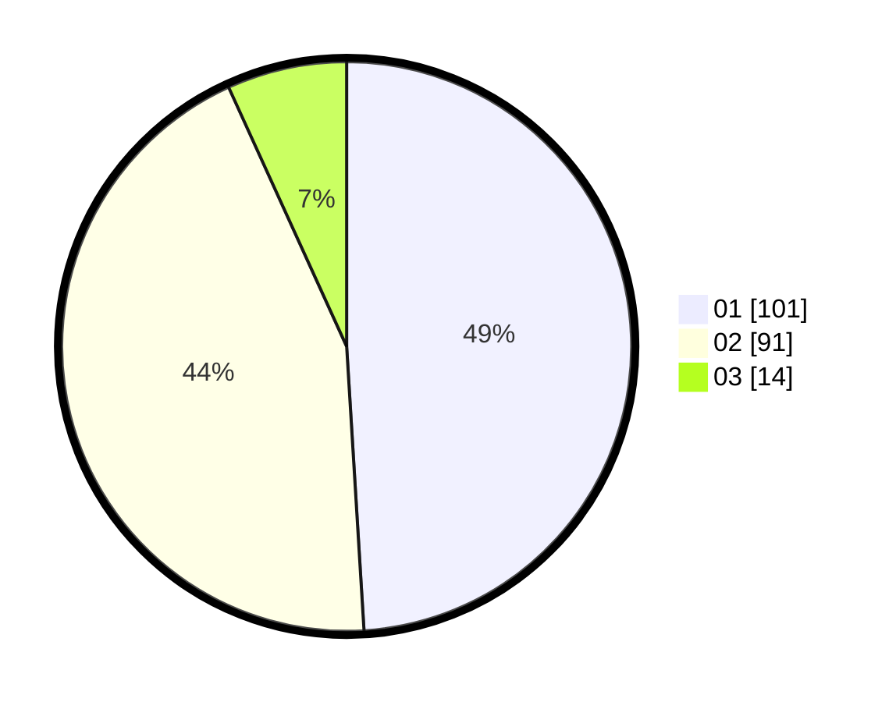

# Hasil

Hasil perolehan suara paslon dapat dilihat pada file paslon-01.txt, paslon-02.txt, dan paslon-03.txt.

Jika tidak ada, artinya data tersebut belum ada pada SIREKAP.

## Perolehan Suara

 * Paslon 01: **101**.
 * Paslon 02: **91**.
 * Paslon 03: **14**.

## Foto C Plano

https://sirekap-obj-formc.kpu.go.id/a162/pemilu/ppwp/31/73/06/10/05/3173061005010-20240214-185408--1369eda6-64c4-4ab7-8faa-d671996c907b.jpg

https://sirekap-obj-formc.kpu.go.id/a162/pemilu/ppwp/31/73/06/10/05/3173061005010-20240214-185425--02e47af8-1ba0-4964-911d-23fd4cbc5f84.jpg

https://sirekap-obj-formc.kpu.go.id/a162/pemilu/ppwp/31/73/06/10/05/3173061005010-20240214-185504--7644c310-c781-4381-841b-1779b3240356.jpg
