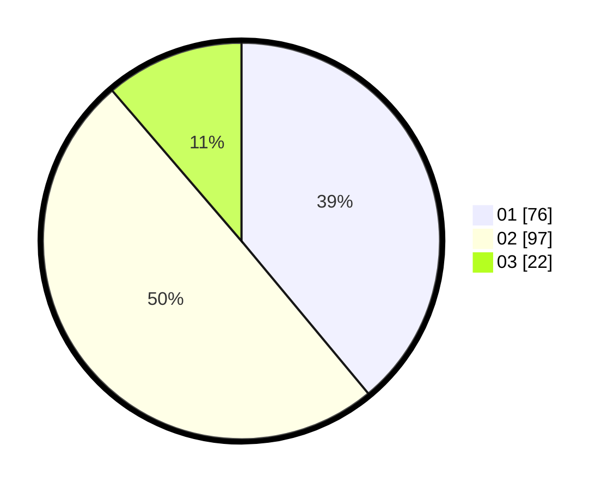

# Hasil

Hasil perolehan suara paslon dapat dilihat pada file paslon-01.txt, paslon-02.txt, dan paslon-03.txt.

Jika tidak ada, artinya data tersebut belum ada pada SIREKAP.

## Perolehan Suara

 * Paslon 01: **76**.
 * Paslon 02: **97**.
 * Paslon 03: **22**.

## Foto C Plano

https://sirekap-obj-formc.kpu.go.id/8c03/pemilu/ppwp/31/73/06/10/05/3173061005012-20240214-162231--2a94006d-98b1-4757-8e67-a4fcb681bd6e.jpg

https://sirekap-obj-formc.kpu.go.id/8c03/pemilu/ppwp/31/73/06/10/05/3173061005012-20240214-210054--8c539f2a-9726-416c-abcb-93f1209d6485.jpg

https://sirekap-obj-formc.kpu.go.id/8c03/pemilu/ppwp/31/73/06/10/05/3173061005012-20240214-210101--004ef809-cbdb-497b-824d-0661c64ada40.jpg

## DATA PEMILIH TETAP

Jumlah pemilih dalam DPT: **272**.
 * L: **143**.
 * P: **129**.

## DATA PENGGUNA HAK PILIH

Jumlah pengguna hak pilih dalam DPT: **200**.
 * L: **99**.
 * P: **101**.

Jumlah pengguna hak pilih dalam DPTb: **0**.
 * L: **0**.
 * P: **0**.

Jumlah pengguna hak pilih dalam DPK: **0**.
 * L: **0**.
 * P: **0**.

Jumlah pengguna hak pilih: **200**.
 * L: **99**.
 * P: **101**.

## JUMLAH SUARA SAH DAN TIDAK SAH

JUMLAH SELURUH SUARA SAH: **195**.

JUMLAH SUARA TIDAK SAH: **5**.

JUMLAH SELURUH SUARA SAH DAN SUARA TIDAK SAH: **200**.
