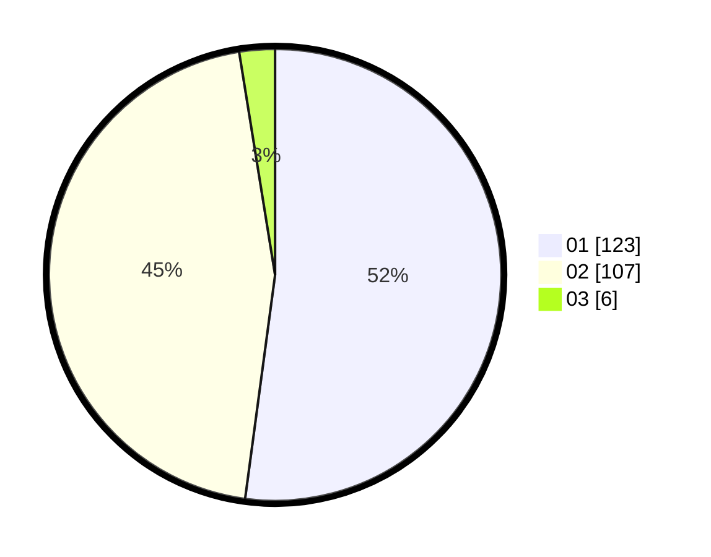

# Hasil

Hasil perolehan suara paslon dapat dilihat pada file paslon-01.txt, paslon-02.txt, dan paslon-03.txt.

Jika tidak ada, artinya data tersebut belum ada pada SIREKAP.

## Perolehan Suara

 * Paslon 01: **123**.
 * Paslon 02: **107**.
 * Paslon 03: **6**.

## Foto C Plano

https://sirekap-obj-formc.kpu.go.id/bfe4/pemilu/ppwp/31/73/06/10/05/3173061005017-20240214-234823--e6150909-ddef-4f20-a363-0b3c36a06e07.jpg

https://sirekap-obj-formc.kpu.go.id/bfe4/pemilu/ppwp/31/73/06/10/05/3173061005017-20240214-191659--e4c618ff-e150-4aef-b225-8c9dccd49641.jpg

https://sirekap-obj-formc.kpu.go.id/bfe4/pemilu/ppwp/31/73/06/10/05/3173061005017-20240214-234854--b0c5e8ba-75e6-4216-83a0-01dc90aaa5e6.jpg
