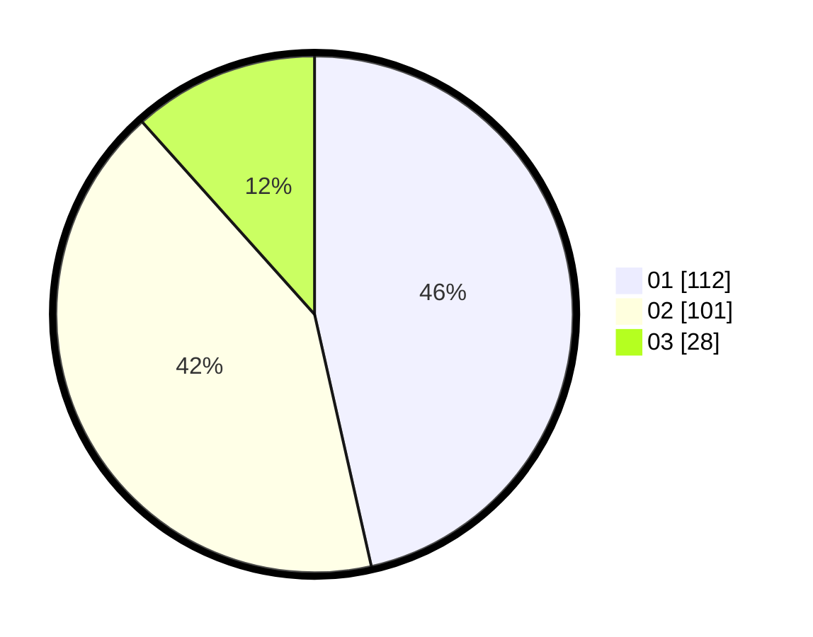

# Hasil

Hasil perolehan suara paslon dapat dilihat pada file paslon-01.txt, paslon-02.txt, dan paslon-03.txt.

Jika tidak ada, artinya data tersebut belum ada pada SIREKAP.

## Perolehan Suara

 * Paslon 01: **112**.
 * Paslon 02: **101**.
 * Paslon 03: **28**.

## Foto C Plano

https://sirekap-obj-formc.kpu.go.id/6022/pemilu/ppwp/31/73/06/10/05/3173061005027-20240214-220500--5936761a-a18d-445a-a595-aaec52f69632.jpg

https://sirekap-obj-formc.kpu.go.id/6022/pemilu/ppwp/31/73/06/10/05/3173061005027-20240214-221141--f43383ab-1ebb-455e-a2e2-94e659e84c1a.jpg

https://sirekap-obj-formc.kpu.go.id/6022/pemilu/ppwp/31/73/06/10/05/3173061005027-20240214-221257--e93ce2ae-ec00-434b-9a82-d7297b147df9.jpg
