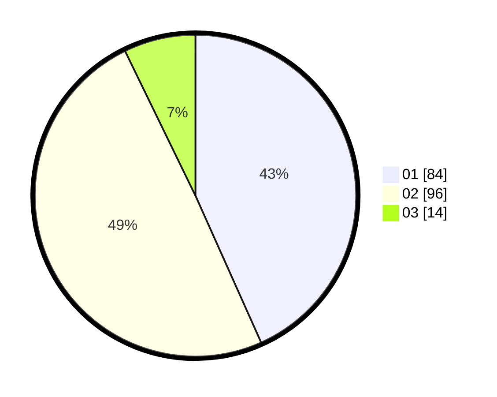

# Hasil

Hasil perolehan suara paslon dapat dilihat pada file paslon-01.txt, paslon-02.txt, dan paslon-03.txt.

Jika tidak ada, artinya data tersebut belum ada pada SIREKAP.

## Perolehan Suara

 * Paslon 01: **84**.
 * Paslon 02: **96**.
 * Paslon 03: **14**.

## Foto C Plano

https://sirekap-obj-formc.kpu.go.id/7bb1/pemilu/ppwp/31/73/06/10/05/3173061005028-20240215-224650--17a7e69f-aab4-431b-ad42-a2541180e42d.jpg

https://sirekap-obj-formc.kpu.go.id/7bb1/pemilu/ppwp/31/73/06/10/05/3173061005028-20240214-230306--c05bdf45-d4d2-4472-89c7-8fbf600e81d6.jpg

https://sirekap-obj-formc.kpu.go.id/7bb1/pemilu/ppwp/31/73/06/10/05/3173061005028-20240214-193647--6faf80a2-5b58-43df-a8ed-1b8804f80c67.jpg
