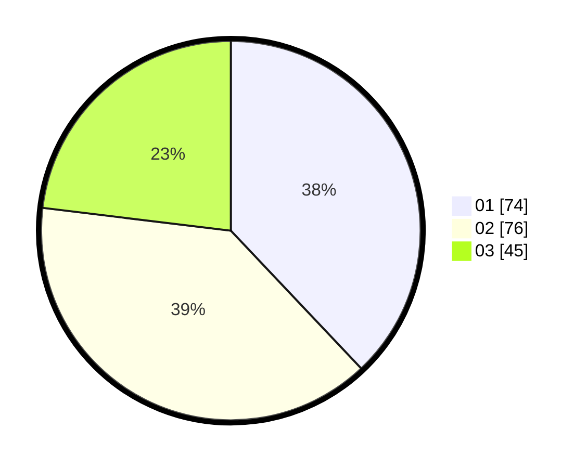

# Hasil

Hasil perolehan suara paslon dapat dilihat pada file paslon-01.txt, paslon-02.txt, dan paslon-03.txt.

Jika tidak ada, artinya data tersebut belum ada pada SIREKAP.

## Perolehan Suara

 * Paslon 01: **74**.
 * Paslon 02: **76**.
 * Paslon 03: **45**.

## Foto C Plano

https://sirekap-obj-formc.kpu.go.id/9a08/pemilu/ppwp/31/73/06/10/05/3173061005032-20240214-212445--2706ec68-20fa-442c-b578-9822f3df6490.jpg

https://sirekap-obj-formc.kpu.go.id/9a08/pemilu/ppwp/31/73/06/10/05/3173061005032-20240214-212811--ef2d43a2-f0ee-4f5b-af5c-13e5267d9f15.jpg

https://sirekap-obj-formc.kpu.go.id/9a08/pemilu/ppwp/31/73/06/10/05/3173061005032-20240214-212942--c2c5a81f-a1fa-4bb2-b2e3-e5b7b0037c0a.jpg
