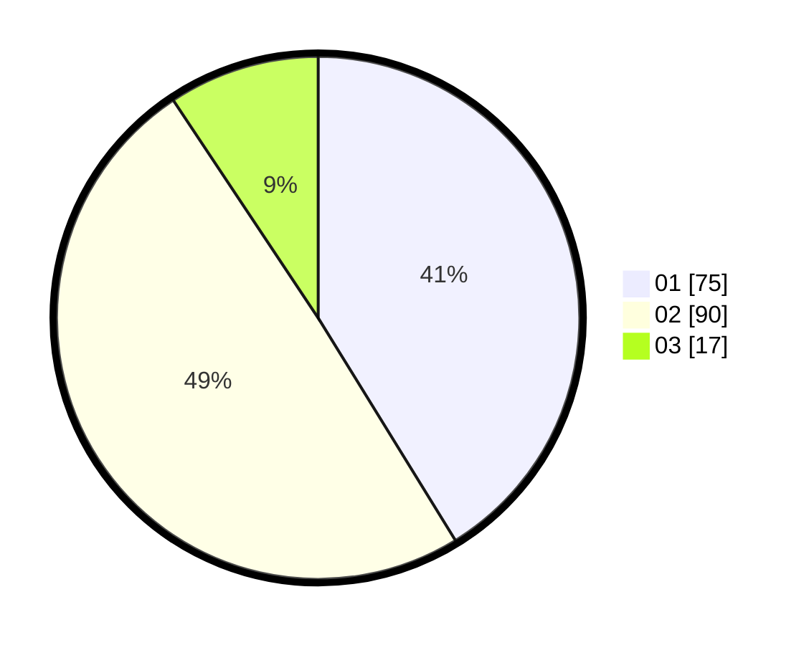

# Hasil

Hasil perolehan suara paslon dapat dilihat pada file paslon-01.txt, paslon-02.txt, dan paslon-03.txt.

Jika tidak ada, artinya data tersebut belum ada pada SIREKAP.

## Perolehan Suara

 * Paslon 01: **75**.
 * Paslon 02: **90**.
 * Paslon 03: **17**.

## Foto C Plano

https://sirekap-obj-formc.kpu.go.id/32ac/pemilu/ppwp/31/73/06/10/05/3173061005033-20240214-212913--e7bf6628-3e6a-4bcf-98ad-f8d46881af61.jpg

https://sirekap-obj-formc.kpu.go.id/32ac/pemilu/ppwp/31/73/06/10/05/3173061005033-20240214-213042--ee16a0e5-ea05-484b-a13d-21b151be4dec.jpg

https://sirekap-obj-formc.kpu.go.id/32ac/pemilu/ppwp/31/73/06/10/05/3173061005033-20240214-213205--0f5149f1-876c-4d9c-b3c3-084dc173444b.jpg

## DATA PEMILIH TETAP

Jumlah pemilih dalam DPT: **254**.
 * L: **127**.
 * P: **127**.

## DATA PENGGUNA HAK PILIH

Jumlah pengguna hak pilih dalam DPT: **187**.
 * L: **91**.
 * P: **96**.

Jumlah pengguna hak pilih dalam DPTb: **1**.
 * L: **1**.
 * P: **0**.

Jumlah pengguna hak pilih dalam DPK: **2**.
 * L: **1**.
 * P: **1**.

Jumlah pengguna hak pilih: **190**.
 * L: **93**.
 * P: **97**.

## JUMLAH SUARA SAH DAN TIDAK SAH

JUMLAH SELURUH SUARA SAH: **182**.

JUMLAH SUARA TIDAK SAH: **8**.

JUMLAH SELURUH SUARA SAH DAN SUARA TIDAK SAH: **190**.
