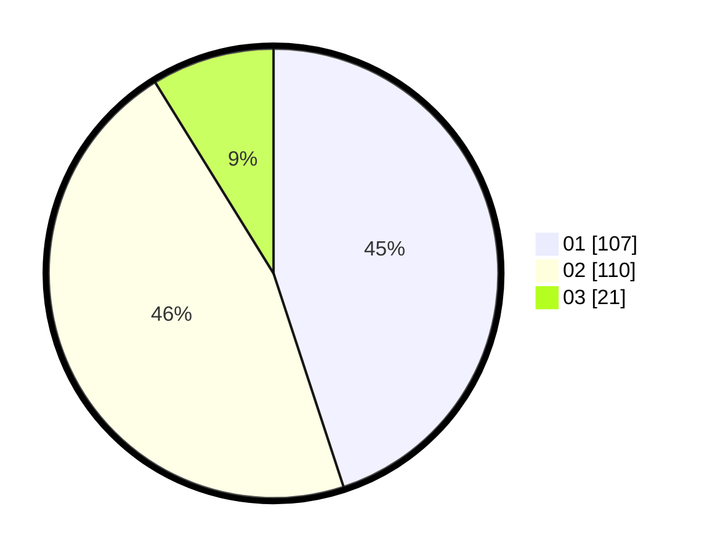

# Hasil

Hasil perolehan suara paslon dapat dilihat pada file paslon-01.txt, paslon-02.txt, dan paslon-03.txt.

Jika tidak ada, artinya data tersebut belum ada pada SIREKAP.

## Perolehan Suara

 * Paslon 01: **107**.
 * Paslon 02: **110**.
 * Paslon 03: **21**.

## Foto C Plano

https://sirekap-obj-formc.kpu.go.id/aaf5/pemilu/ppwp/31/73/06/10/05/3173061005038-20240215-010814--50ec9558-3ad7-4ab1-babd-4717fd4505cc.jpg

https://sirekap-obj-formc.kpu.go.id/aaf5/pemilu/ppwp/31/73/06/10/05/3173061005038-20240215-010351--b62f84a1-f5ec-4f1a-81cb-3af144ec758d.jpg

https://sirekap-obj-formc.kpu.go.id/aaf5/pemilu/ppwp/31/73/06/10/05/3173061005038-20240215-010728--bfcf633c-8317-48c4-9b89-a558054ec28f.jpg

## DATA PEMILIH TETAP

Jumlah pemilih dalam DPT: **283**.
 * L: **137**.
 * P: **746**.

## DATA PENGGUNA HAK PILIH

Jumlah pengguna hak pilih dalam DPT: **236**.
 * L: **109**.
 * P: **127**.

Jumlah pengguna hak pilih dalam DPTb: **3**.
 * L: **1**.
 * P: **2**.

Jumlah pengguna hak pilih dalam DPK: **0**.
 * L: **0**.
 * P: **0**.

Jumlah pengguna hak pilih: **239**.
 * L: **110**.
 * P: **129**.

## JUMLAH SUARA SAH DAN TIDAK SAH

JUMLAH SELURUH SUARA SAH: **238**.

JUMLAH SUARA TIDAK SAH: **1**.

JUMLAH SELURUH SUARA SAH DAN SUARA TIDAK SAH: **239**.
