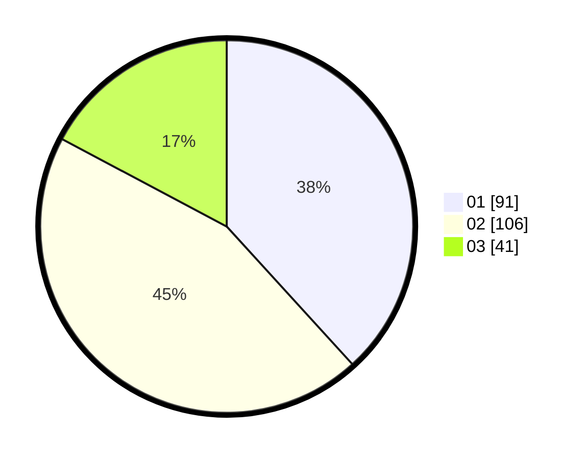

# Hasil

Hasil perolehan suara paslon dapat dilihat pada file paslon-01.txt, paslon-02.txt, dan paslon-03.txt.

Jika tidak ada, artinya data tersebut belum ada pada SIREKAP.

## Perolehan Suara

 * Paslon 01: **91**.
 * Paslon 02: **106**.
 * Paslon 03: **41**.

## Foto C Plano

https://sirekap-obj-formc.kpu.go.id/7b8b/pemilu/ppwp/31/73/06/10/05/3173061005040-20240215-000529--a6a71954-640a-4c73-8ee7-bab6c8bd2add.jpg

https://sirekap-obj-formc.kpu.go.id/7b8b/pemilu/ppwp/31/73/06/10/05/3173061005040-20240215-000608--c219aa11-2991-46eb-9bcd-1bb532b0c504.jpg

https://sirekap-obj-formc.kpu.go.id/7b8b/pemilu/ppwp/31/73/06/10/05/3173061005040-20240215-000730--3d1ebd59-5a01-4033-b6b1-52ab7eff0726.jpg
