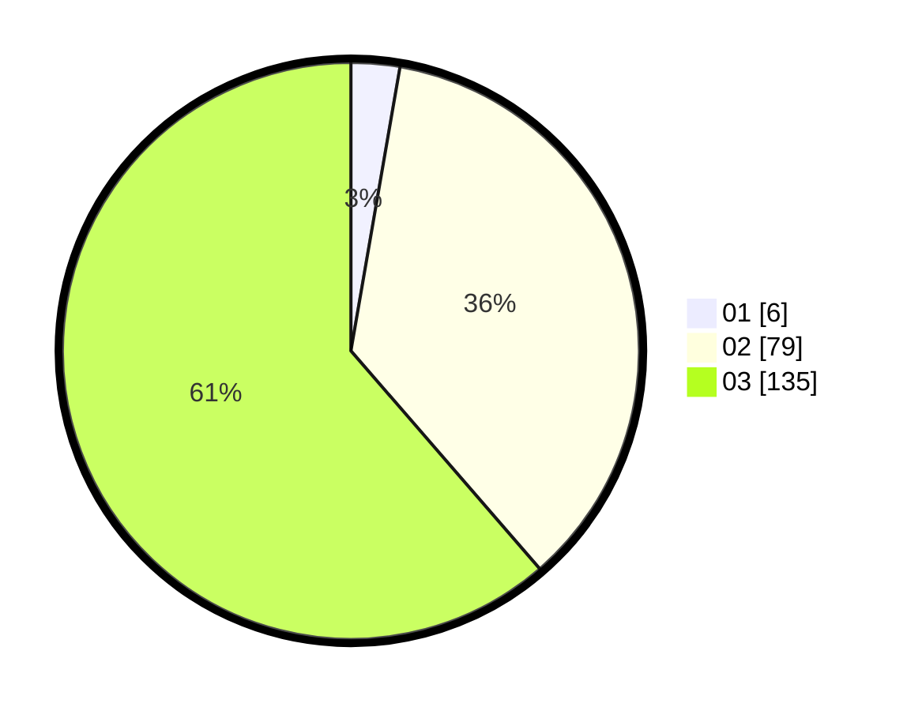

# Hasil

Hasil perolehan suara paslon dapat dilihat pada file paslon-01.txt, paslon-02.txt, dan paslon-03.txt.

Jika tidak ada, artinya data tersebut belum ada pada SIREKAP.

## Perolehan Suara

 * Paslon 01: **6**.
 * Paslon 02: **79**.
 * Paslon 03: **135**.

## Foto C Plano

https://sirekap-obj-formc.kpu.go.id/e17d/pemilu/ppwp/31/73/06/10/05/3173061005043-20240214-204828--dd032725-f029-4c46-be89-6019ca3d8db6.jpg

https://sirekap-obj-formc.kpu.go.id/e17d/pemilu/ppwp/31/73/06/10/05/3173061005043-20240214-214543--3f79f274-27ed-469a-8219-750706686d93.jpg

https://sirekap-obj-formc.kpu.go.id/e17d/pemilu/ppwp/31/73/06/10/05/3173061005043-20240214-214434--d258c866-92f3-4408-b178-42307a68e22b.jpg
