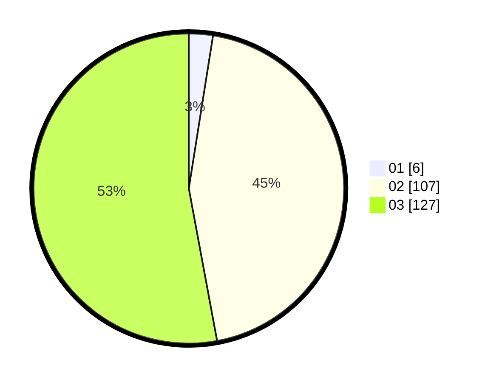

# Hasil

Hasil perolehan suara paslon dapat dilihat pada file paslon-01.txt, paslon-02.txt, dan paslon-03.txt.

Jika tidak ada, artinya data tersebut belum ada pada SIREKAP.

## Perolehan Suara

 * Paslon 01: **6**.
 * Paslon 02: **107**.
 * Paslon 03: **127**.

## Foto C Plano

https://sirekap-obj-formc.kpu.go.id/78b0/pemilu/ppwp/31/73/06/10/05/3173061005046-20240214-225954--00cdbe96-6405-4cef-ad78-e4fc5a3e5b4a.jpg

https://sirekap-obj-formc.kpu.go.id/78b0/pemilu/ppwp/31/73/06/10/05/3173061005046-20240214-230009--4368309c-ccc1-4128-a9e9-43d784381b58.jpg

https://sirekap-obj-formc.kpu.go.id/78b0/pemilu/ppwp/31/73/06/10/05/3173061005046-20240214-230015--998006eb-48aa-4082-b401-84de48d1ceb2.jpg
