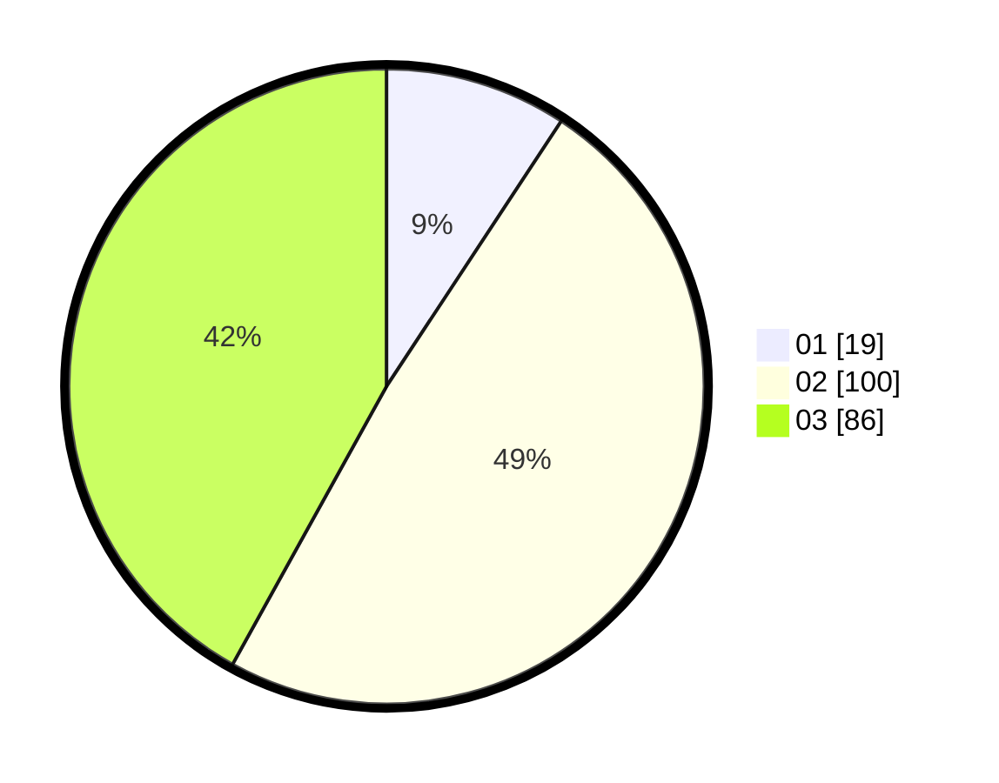

# Hasil

Hasil perolehan suara paslon dapat dilihat pada file paslon-01.txt, paslon-02.txt, dan paslon-03.txt.

Jika tidak ada, artinya data tersebut belum ada pada SIREKAP.

## Perolehan Suara

 * Paslon 01: **19**.
 * Paslon 02: **100**.
 * Paslon 03: **86**.

## Foto C Plano

https://sirekap-obj-formc.kpu.go.id/7ec4/pemilu/ppwp/31/73/06/10/05/3173061005050-20240214-204550--8d38030c-b0b9-4f73-bb4a-9c4af1ab9f47.jpg

https://sirekap-obj-formc.kpu.go.id/7ec4/pemilu/ppwp/31/73/06/10/05/3173061005050-20240214-204552--81acadcc-1f5b-4005-a014-fae6737b5efc.jpg

https://sirekap-obj-formc.kpu.go.id/7ec4/pemilu/ppwp/31/73/06/10/05/3173061005050-20240214-204555--c5a9d012-4fc1-44c5-ab7f-5a6122dccf33.jpg

## DATA PEMILIH TETAP

Jumlah pemilih dalam DPT: **234**.
 * L: **108**.
 * P: **126**.

## DATA PENGGUNA HAK PILIH

Jumlah pengguna hak pilih dalam DPT: **187**.
 * L: **88**.
 * P: **99**.

Jumlah pengguna hak pilih dalam DPTb: **5**.
 * L: **2**.
 * P: **3**.

Jumlah pengguna hak pilih dalam DPK: **13**.
 * L: **6**.
 * P: **7**.

Jumlah pengguna hak pilih: **205**.
 * L: **96**.
 * P: **109**.

## JUMLAH SUARA SAH DAN TIDAK SAH

JUMLAH SELURUH SUARA SAH: **205**.

JUMLAH SUARA TIDAK SAH: **0**.

JUMLAH SELURUH SUARA SAH DAN SUARA TIDAK SAH: **205**.
