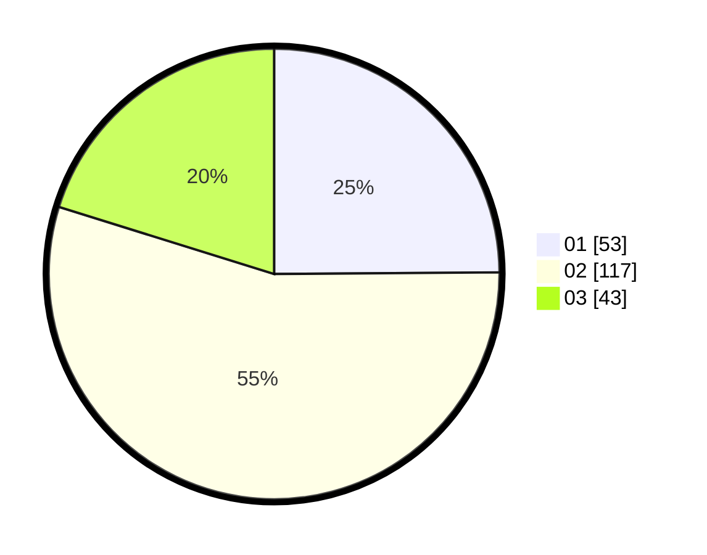

# Hasil

Hasil perolehan suara paslon dapat dilihat pada file paslon-01.txt, paslon-02.txt, dan paslon-03.txt.

Jika tidak ada, artinya data tersebut belum ada pada SIREKAP.

## Perolehan Suara

 * Paslon 01: **53**.
 * Paslon 02: **117**.
 * Paslon 03: **43**.

## Foto C Plano

https://sirekap-obj-formc.kpu.go.id/649e/pemilu/ppwp/31/73/06/10/05/3173061005067-20240216-142427--9fbf9ed5-aec4-49ea-beae-e0943ea52bca.jpg

https://sirekap-obj-formc.kpu.go.id/649e/pemilu/ppwp/31/73/06/10/05/3173061005067-20240216-142428--84b2faf3-3472-412e-8f6c-5281c8e8c434.jpg

https://sirekap-obj-formc.kpu.go.id/649e/pemilu/ppwp/31/73/06/10/05/3173061005067-20240216-142427--5bf044e2-7df2-4d08-9cf0-e42b72fea6fd.jpg

## DATA PEMILIH TETAP

Jumlah pemilih dalam DPT: **285**.
 * L: **139**.
 * P: **146**.

## DATA PENGGUNA HAK PILIH

Jumlah pengguna hak pilih dalam DPT: **206**.
 * L: **99**.
 * P: **107**.

Jumlah pengguna hak pilih dalam DPTb: **0**.
 * L: **0**.
 * P: **0**.

Jumlah pengguna hak pilih dalam DPK: **10**.
 * L: **6**.
 * P: **4**.

Jumlah pengguna hak pilih: **0**.
 * L: **0**.
 * P: **0**.

## JUMLAH SUARA SAH DAN TIDAK SAH

JUMLAH SELURUH SUARA SAH: **213**.

JUMLAH SUARA TIDAK SAH: **3**.

JUMLAH SELURUH SUARA SAH DAN SUARA TIDAK SAH: **216**.
