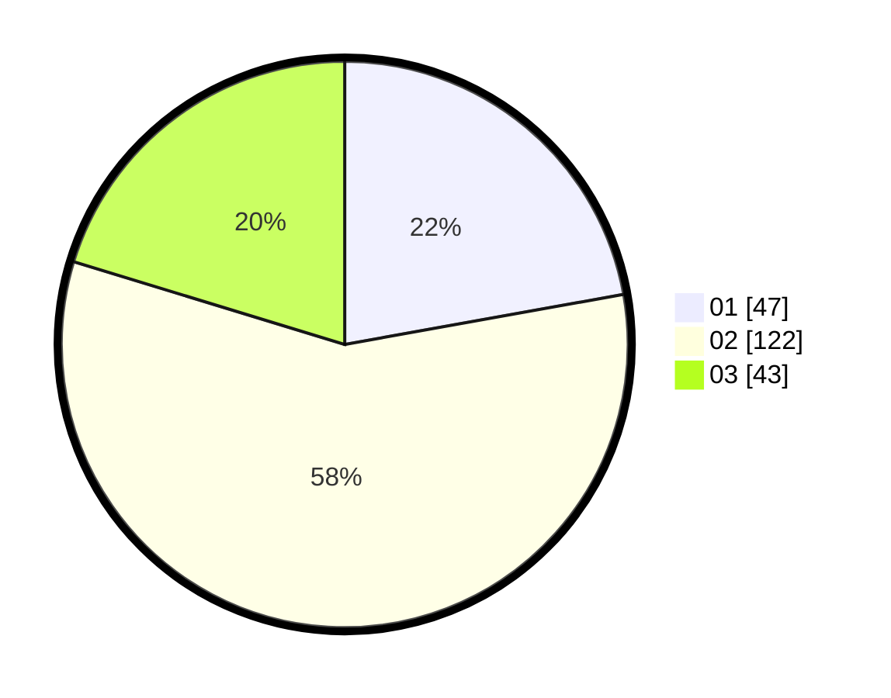

# Hasil

Hasil perolehan suara paslon dapat dilihat pada file paslon-01.txt, paslon-02.txt, dan paslon-03.txt.

Jika tidak ada, artinya data tersebut belum ada pada SIREKAP.

## Perolehan Suara

 * Paslon 01: **47**.
 * Paslon 02: **122**.
 * Paslon 03: **43**.

## Foto C Plano

https://sirekap-obj-formc.kpu.go.id/fb8f/pemilu/ppwp/31/73/06/10/05/3173061005074-20240214-231321--a3631ab3-78b9-42cf-bd86-371a8f2a989d.jpg

https://sirekap-obj-formc.kpu.go.id/fb8f/pemilu/ppwp/31/73/06/10/05/3173061005074-20240214-231628--e2438fd1-e172-4f05-a08c-d267a7d92f07.jpg

https://sirekap-obj-formc.kpu.go.id/fb8f/pemilu/ppwp/31/73/06/10/05/3173061005074-20240214-231753--14beefa2-f1a0-44dc-bbae-c67b7bfcebb3.jpg
