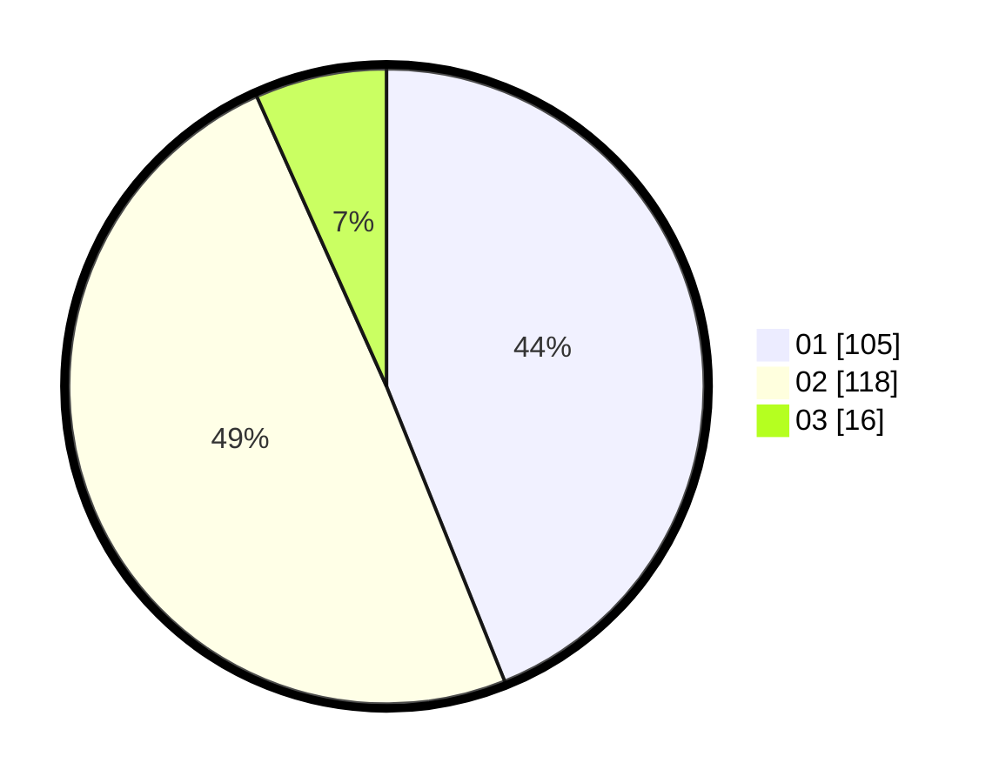

# Hasil

Hasil perolehan suara paslon dapat dilihat pada file paslon-01.txt, paslon-02.txt, dan paslon-03.txt.

Jika tidak ada, artinya data tersebut belum ada pada SIREKAP.

## Perolehan Suara

 * Paslon 01: **105**.
 * Paslon 02: **118**.
 * Paslon 03: **16**.

## Foto C Plano

https://sirekap-obj-formc.kpu.go.id/1ee6/pemilu/ppwp/31/73/06/10/05/3173061005078-20240214-222554--431bfa58-da36-4b8b-8e29-9062726ba662.jpg

https://sirekap-obj-formc.kpu.go.id/1ee6/pemilu/ppwp/31/73/06/10/05/3173061005078-20240214-222715--0d3a34ea-57ed-48a5-bb24-f77d95e829fb.jpg

https://sirekap-obj-formc.kpu.go.id/1ee6/pemilu/ppwp/31/73/06/10/05/3173061005078-20240214-222835--223248ec-794d-461b-94cf-0f08573475b8.jpg
