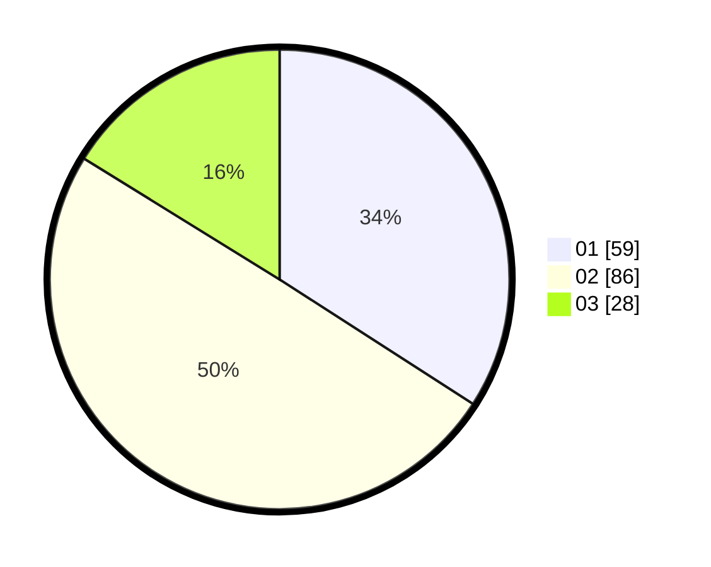

# Hasil

Hasil perolehan suara paslon dapat dilihat pada file paslon-01.txt, paslon-02.txt, dan paslon-03.txt.

Jika tidak ada, artinya data tersebut belum ada pada SIREKAP.

## Perolehan Suara

 * Paslon 01: **59**.
 * Paslon 02: **86**.
 * Paslon 03: **28**.

## Foto C Plano

https://sirekap-obj-formc.kpu.go.id/5d94/pemilu/ppwp/31/73/06/10/05/3173061005079-20240214-201024--37f95ea6-4bde-4b50-a86b-ecbb64642ec3.jpg

https://sirekap-obj-formc.kpu.go.id/5d94/pemilu/ppwp/31/73/06/10/05/3173061005079-20240214-201248--cdf09cdc-6cdb-4078-bba8-b00e496a6d23.jpg

https://sirekap-obj-formc.kpu.go.id/5d94/pemilu/ppwp/31/73/06/10/05/3173061005079-20240214-201254--25f86fdd-8535-46d0-bb36-7b70c6cd769e.jpg

## DATA PEMILIH TETAP

Jumlah pemilih dalam DPT: **183**.
 * L: **90**.
 * P: **93**.

## DATA PENGGUNA HAK PILIH

Jumlah pengguna hak pilih dalam DPT: **172**.
 * L: **86**.
 * P: **86**.

Jumlah pengguna hak pilih dalam DPTb: **2**.
 * L: **1**.
 * P: **1**.

Jumlah pengguna hak pilih dalam DPK: **0**.
 * L: **0**.
 * P: **0**.

Jumlah pengguna hak pilih: **174**.
 * L: **87**.
 * P: **87**.

## JUMLAH SUARA SAH DAN TIDAK SAH

JUMLAH SELURUH SUARA SAH: **173**.

JUMLAH SUARA TIDAK SAH: **1**.

JUMLAH SELURUH SUARA SAH DAN SUARA TIDAK SAH: **174**.
