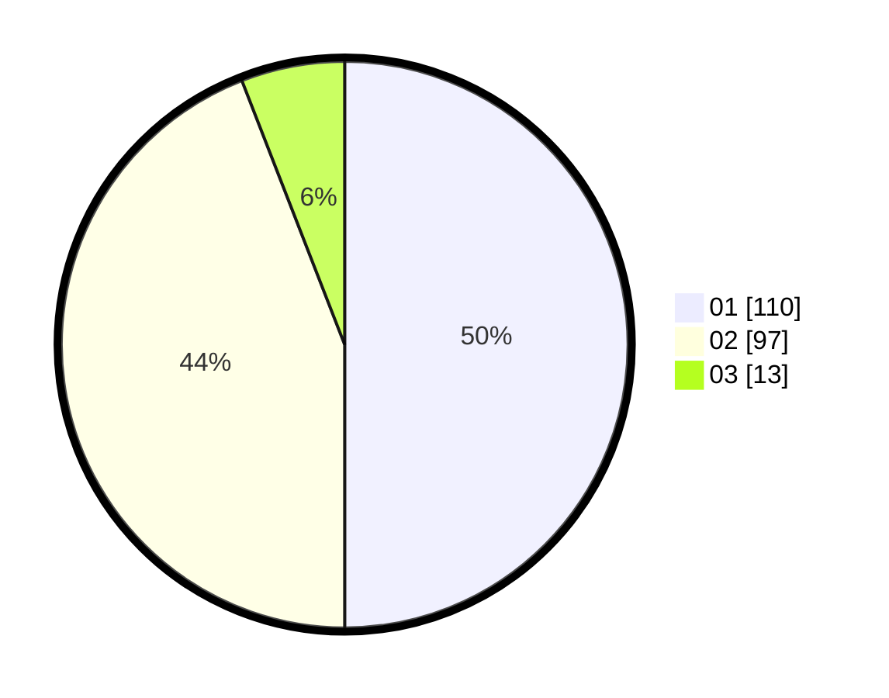

# Hasil

Hasil perolehan suara paslon dapat dilihat pada file paslon-01.txt, paslon-02.txt, dan paslon-03.txt.

Jika tidak ada, artinya data tersebut belum ada pada SIREKAP.

## Perolehan Suara

 * Paslon 01: **110**.
 * Paslon 02: **97**.
 * Paslon 03: **13**.

## Foto C Plano

https://sirekap-obj-formc.kpu.go.id/9821/pemilu/ppwp/31/73/06/10/05/3173061005088-20240214-221946--19904e88-fc6b-4cad-9b17-bd2adc0f7a94.jpg

https://sirekap-obj-formc.kpu.go.id/9821/pemilu/ppwp/31/73/06/10/05/3173061005088-20240214-215232--3be77859-4436-4c16-a6f2-11ebaaa026c6.jpg

https://sirekap-obj-formc.kpu.go.id/9821/pemilu/ppwp/31/73/06/10/05/3173061005088-20240214-220237--69b84ce7-b96e-4aef-bb14-97883a62ed6c.jpg
