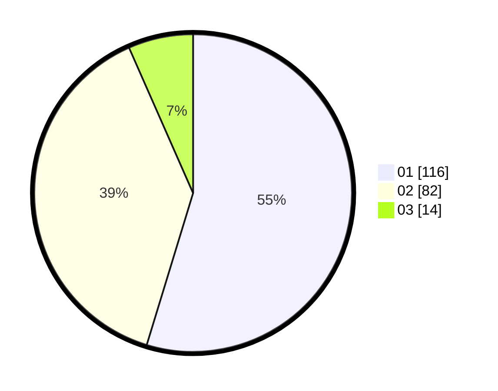

# Hasil

Hasil perolehan suara paslon dapat dilihat pada file paslon-01.txt, paslon-02.txt, dan paslon-03.txt.

Jika tidak ada, artinya data tersebut belum ada pada SIREKAP.

## Perolehan Suara

 * Paslon 01: **116**.
 * Paslon 02: **82**.
 * Paslon 03: **14**.

## Foto C Plano

https://sirekap-obj-formc.kpu.go.id/f492/pemilu/ppwp/31/73/06/10/05/3173061005090-20240216-144500--69c3daca-ca34-468c-a6f7-1cc17a70c5a4.jpg

https://sirekap-obj-formc.kpu.go.id/f492/pemilu/ppwp/31/73/06/10/05/3173061005090-20240216-144502--0ad32776-eddc-41b1-9d63-de2d348a8f0f.jpg

https://sirekap-obj-formc.kpu.go.id/f492/pemilu/ppwp/31/73/06/10/05/3173061005090-20240216-144501--952a85ea-c41d-4d7d-bf79-c904098c9518.jpg

## DATA PEMILIH TETAP

Jumlah pemilih dalam DPT: **252**.
 * L: **121**.
 * P: **131**.

## DATA PENGGUNA HAK PILIH

Jumlah pengguna hak pilih dalam DPT: **219**.
 * L: **112**.
 * P: **107**.

Jumlah pengguna hak pilih dalam DPTb: **0**.
 * L: **0**.
 * P: **0**.

Jumlah pengguna hak pilih dalam DPK: **0**.
 * L: **0**.
 * P: **0**.

Jumlah pengguna hak pilih: **219**.
 * L: **112**.
 * P: **107**.

## JUMLAH SUARA SAH DAN TIDAK SAH

JUMLAH SELURUH SUARA SAH: **212**.

JUMLAH SUARA TIDAK SAH: **7**.

JUMLAH SELURUH SUARA SAH DAN SUARA TIDAK SAH: **219**.
