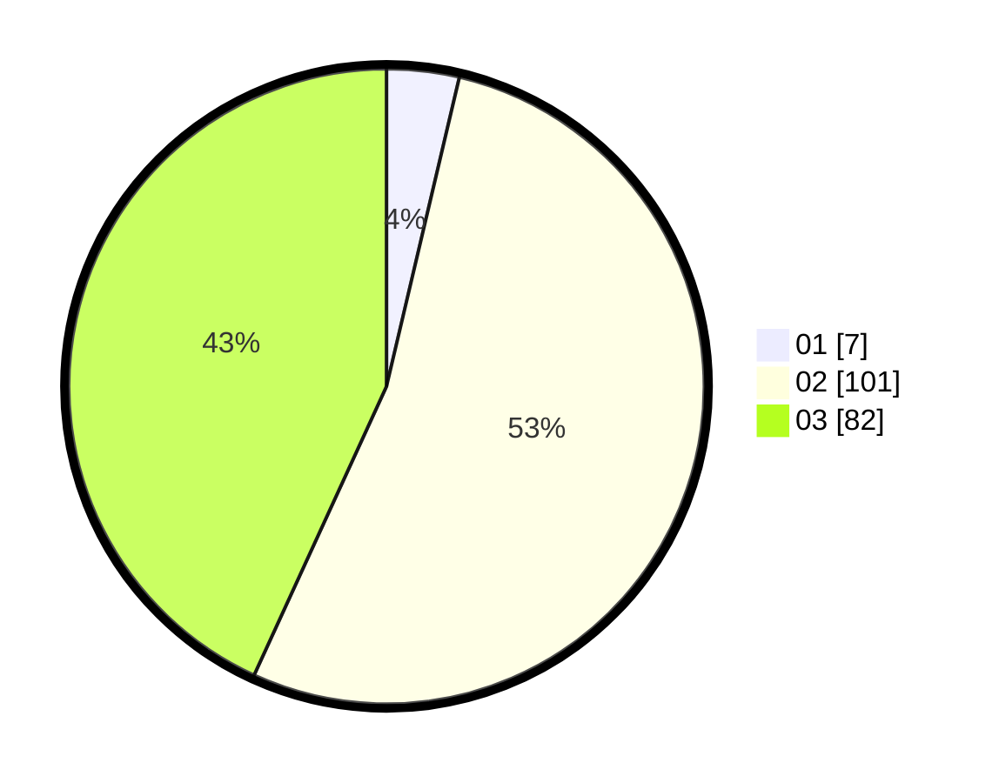

# Hasil

Hasil perolehan suara paslon dapat dilihat pada file paslon-01.txt, paslon-02.txt, dan paslon-03.txt.

Jika tidak ada, artinya data tersebut belum ada pada SIREKAP.

## Perolehan Suara

 * Paslon 01: **7**.
 * Paslon 02: **101**.
 * Paslon 03: **82**.

## Foto C Plano

https://sirekap-obj-formc.kpu.go.id/2138/pemilu/ppwp/31/73/06/10/05/3173061005094-20240214-233301--5db45fa5-775e-4707-bfc9-c194e42d8984.jpg

https://sirekap-obj-formc.kpu.go.id/2138/pemilu/ppwp/31/73/06/10/05/3173061005094-20240214-233333--1626eae5-c0ed-437e-b9b0-b27a83a94d6d.jpg

https://sirekap-obj-formc.kpu.go.id/2138/pemilu/ppwp/31/73/06/10/05/3173061005094-20240214-233405--4aa2d9ce-46ac-4128-8cc6-44dc8daa64d1.jpg
