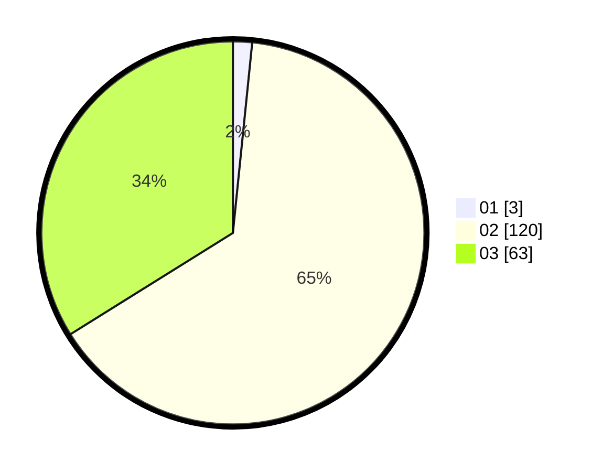

# Hasil

Hasil perolehan suara paslon dapat dilihat pada file paslon-01.txt, paslon-02.txt, dan paslon-03.txt.

Jika tidak ada, artinya data tersebut belum ada pada SIREKAP.

## Perolehan Suara

 * Paslon 01: **3**.
 * Paslon 02: **120**.
 * Paslon 03: **63**.

## Foto C Plano

https://sirekap-obj-formc.kpu.go.id/119d/pemilu/ppwp/31/73/06/10/05/3173061005095-20240214-195613--1a0fb490-9e77-4155-b65c-3b2c54822688.jpg

https://sirekap-obj-formc.kpu.go.id/119d/pemilu/ppwp/31/73/06/10/05/3173061005095-20240214-195706--33448263-b784-4f57-a857-5923e5d68032.jpg

https://sirekap-obj-formc.kpu.go.id/119d/pemilu/ppwp/31/73/06/10/05/3173061005095-20240214-195724--12bc3e47-00f8-43e5-b89c-24f4e267d2ba.jpg
