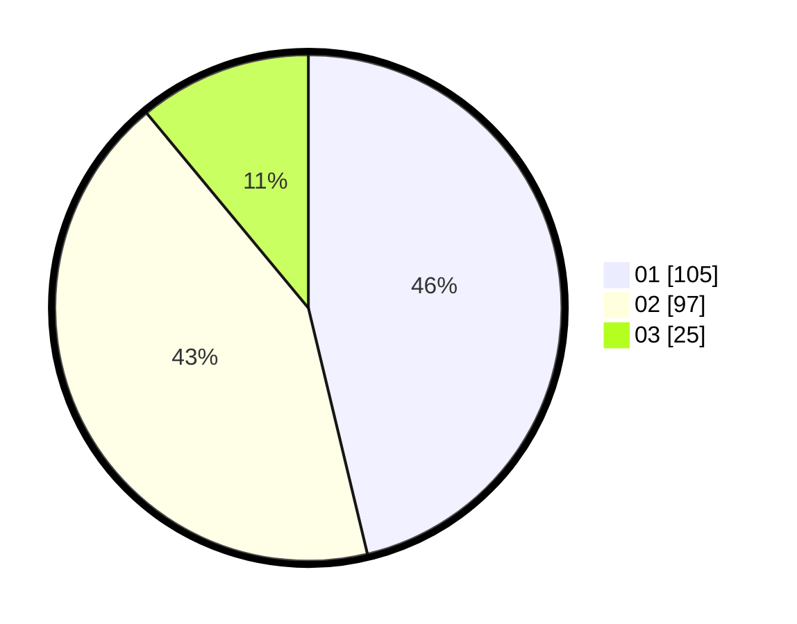

# Hasil

Hasil perolehan suara paslon dapat dilihat pada file paslon-01.txt, paslon-02.txt, dan paslon-03.txt.

Jika tidak ada, artinya data tersebut belum ada pada SIREKAP.

## Perolehan Suara

 * Paslon 01: **105**.
 * Paslon 02: **97**.
 * Paslon 03: **25**.

## Foto C Plano

https://sirekap-obj-formc.kpu.go.id/825c/pemilu/ppwp/31/73/06/10/05/3173061005102-20240214-202554--0a446cdc-2032-4bdb-99ae-5c6292283836.jpg

https://sirekap-obj-formc.kpu.go.id/825c/pemilu/ppwp/31/73/06/10/05/3173061005102-20240214-202546--8f93618c-c2f3-48ef-91b1-25b5adbe9911.jpg

https://sirekap-obj-formc.kpu.go.id/825c/pemilu/ppwp/31/73/06/10/05/3173061005102-20240214-202602--e0bd54b7-c3b7-4440-b1d2-b0953525b72d.jpg
