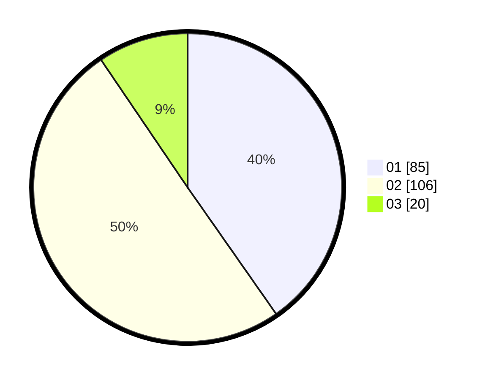

# Hasil

Hasil perolehan suara paslon dapat dilihat pada file paslon-01.txt, paslon-02.txt, dan paslon-03.txt.

Jika tidak ada, artinya data tersebut belum ada pada SIREKAP.

## Perolehan Suara

 * Paslon 01: **85**.
 * Paslon 02: **106**.
 * Paslon 03: **20**.

## Foto C Plano

https://sirekap-obj-formc.kpu.go.id/edda/pemilu/ppwp/31/73/06/10/05/3173061005112-20240214-200638--67729862-0a67-47c3-a0be-031bf79fd02a.jpg

https://sirekap-obj-formc.kpu.go.id/edda/pemilu/ppwp/31/73/06/10/05/3173061005112-20240214-200809--97e201d2-38ec-491f-ad24-5056ddc380f1.jpg

https://sirekap-obj-formc.kpu.go.id/edda/pemilu/ppwp/31/73/06/10/05/3173061005112-20240214-194311--383c872f-d013-45f3-ab20-d4fceae55164.jpg
