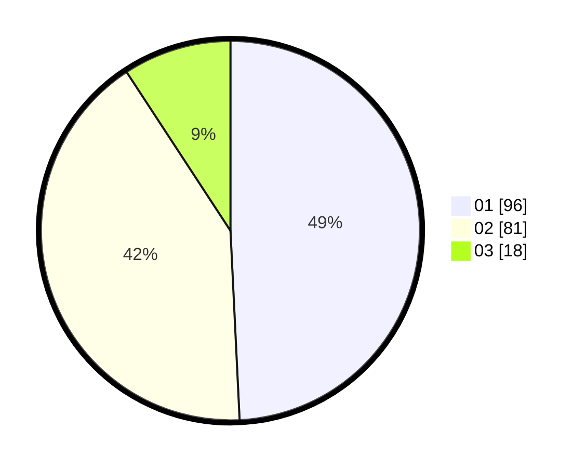

# Hasil

Hasil perolehan suara paslon dapat dilihat pada file paslon-01.txt, paslon-02.txt, dan paslon-03.txt.

Jika tidak ada, artinya data tersebut belum ada pada SIREKAP.

## Perolehan Suara

 * Paslon 01: **96**.
 * Paslon 02: **81**.
 * Paslon 03: **18**.

## Foto C Plano

https://sirekap-obj-formc.kpu.go.id/9e48/pemilu/ppwp/31/73/06/10/05/3173061005114-20240215-011326--2f7a4824-062d-40a3-94a2-45e4b638ba27.jpg

https://sirekap-obj-formc.kpu.go.id/9e48/pemilu/ppwp/31/73/06/10/05/3173061005114-20240215-011417--f7f863d4-35a4-4cc5-9702-0819214b7ed0.jpg

https://sirekap-obj-formc.kpu.go.id/9e48/pemilu/ppwp/31/73/06/10/05/3173061005114-20240215-011456--a32f3ef9-eebb-451a-8e97-2bc49d245fa0.jpg
