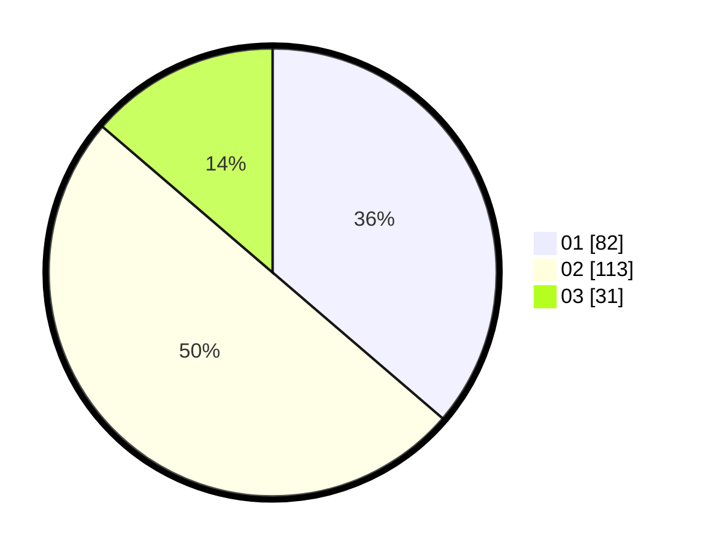

# Hasil

Hasil perolehan suara paslon dapat dilihat pada file paslon-01.txt, paslon-02.txt, dan paslon-03.txt.

Jika tidak ada, artinya data tersebut belum ada pada SIREKAP.

## Perolehan Suara

 * Paslon 01: **82**.
 * Paslon 02: **113**.
 * Paslon 03: **31**.

## Foto C Plano

https://sirekap-obj-formc.kpu.go.id/1315/pemilu/ppwp/31/73/06/10/05/3173061005123-20240219-184205--042f3f3b-f2dc-478d-be7a-d33e5ea31027.jpg

https://sirekap-obj-formc.kpu.go.id/1315/pemilu/ppwp/31/73/06/10/05/3173061005123-20240219-192754--d374cc37-1c63-4e2b-89ec-77442c6b8b3f.jpg

https://sirekap-obj-formc.kpu.go.id/1315/pemilu/ppwp/31/73/06/10/05/3173061005123-20240219-192753--2c8e21a9-de2e-49c6-bd89-6905df56d192.jpg

## DATA PEMILIH TETAP

Jumlah pemilih dalam DPT: **295**.
 * L: **142**.
 * P: **153**.

## DATA PENGGUNA HAK PILIH

Jumlah pengguna hak pilih dalam DPT: **222**.
 * L: **103**.
 * P: **119**.

Jumlah pengguna hak pilih dalam DPTb: **0**.
 * L: **0**.
 * P: **0**.

Jumlah pengguna hak pilih dalam DPK: **6**.
 * L: **4**.
 * P: **2**.

Jumlah pengguna hak pilih: **228**.
 * L: **107**.
 * P: **121**.

## JUMLAH SUARA SAH DAN TIDAK SAH

JUMLAH SELURUH SUARA SAH: **226**.

JUMLAH SUARA TIDAK SAH: **2**.

JUMLAH SELURUH SUARA SAH DAN SUARA TIDAK SAH: **228**.
