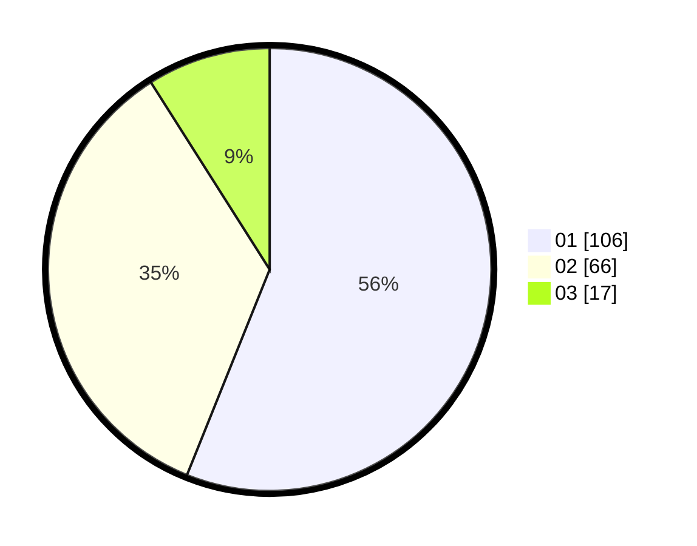

# Hasil

Hasil perolehan suara paslon dapat dilihat pada file paslon-01.txt, paslon-02.txt, dan paslon-03.txt.

Jika tidak ada, artinya data tersebut belum ada pada SIREKAP.

## Perolehan Suara

 * Paslon 01: **106**.
 * Paslon 02: **66**.
 * Paslon 03: **17**.

## Foto C Plano

https://sirekap-obj-formc.kpu.go.id/3185/pemilu/ppwp/31/73/06/10/05/3173061005127-20240214-223857--c8a20765-0c58-48bb-9a99-0f736a3f0bfe.jpg

https://sirekap-obj-formc.kpu.go.id/3185/pemilu/ppwp/31/73/06/10/05/3173061005127-20240214-194433--aabee34f-cebb-42e8-9fd4-8e7814205c3a.jpg

https://sirekap-obj-formc.kpu.go.id/3185/pemilu/ppwp/31/73/06/10/05/3173061005127-20240214-194441--f9cd284c-fddf-47e9-8523-18f24bb749b0.jpg

## DATA PEMILIH TETAP

Jumlah pemilih dalam DPT: **277**.
 * L: **158**.
 * P: **119**.

## DATA PENGGUNA HAK PILIH

Jumlah pengguna hak pilih dalam DPT: **277**.
 * L: **158**.
 * P: **119**.

Jumlah pengguna hak pilih dalam DPTb: **0**.
 * L: **0**.
 * P: **0**.

Jumlah pengguna hak pilih dalam DPK: **0**.
 * L: **0**.
 * P: **0**.

Jumlah pengguna hak pilih: **277**.
 * L: **158**.
 * P: **119**.

## JUMLAH SUARA SAH DAN TIDAK SAH

JUMLAH SELURUH SUARA SAH: **189**.

JUMLAH SUARA TIDAK SAH: **3**.

JUMLAH SELURUH SUARA SAH DAN SUARA TIDAK SAH: **192**.
