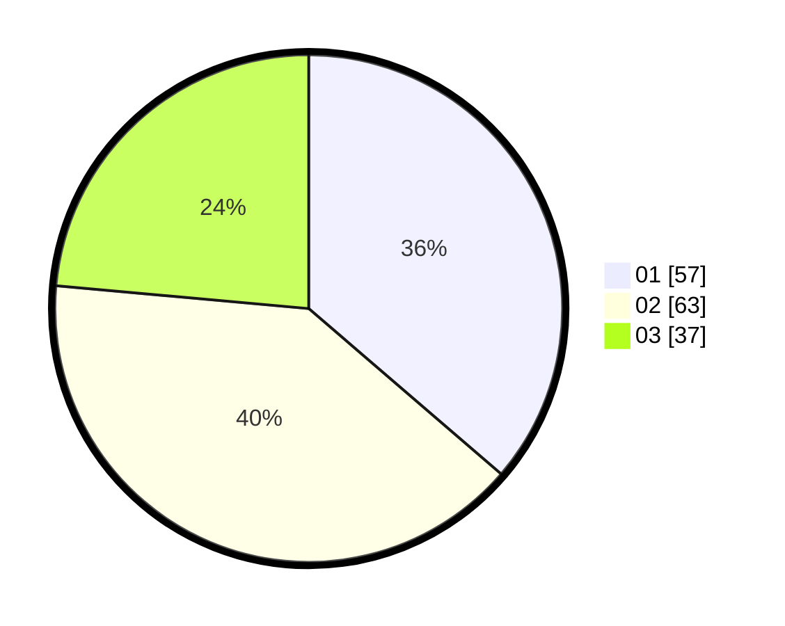

# Hasil

Hasil perolehan suara paslon dapat dilihat pada file paslon-01.txt, paslon-02.txt, dan paslon-03.txt.

Jika tidak ada, artinya data tersebut belum ada pada SIREKAP.

## Perolehan Suara

 * Paslon 01: **57**.
 * Paslon 02: **63**.
 * Paslon 03: **37**.

## Foto C Plano

https://sirekap-obj-formc.kpu.go.id/a97e/pemilu/ppwp/31/73/06/10/05/3173061005131-20240214-201221--5543f0fb-19df-4fa4-a2fb-4785daf57bfe.jpg

https://sirekap-obj-formc.kpu.go.id/a97e/pemilu/ppwp/31/73/06/10/05/3173061005131-20240214-201242--5f7be046-9e28-4df4-adea-9a2011a9da9e.jpg

https://sirekap-obj-formc.kpu.go.id/a97e/pemilu/ppwp/31/73/06/10/05/3173061005131-20240214-201302--e3163091-26a1-4f14-aefa-7f8f1dce9a7e.jpg

## DATA PEMILIH TETAP

Jumlah pemilih dalam DPT: **205**.
 * L: **94**.
 * P: **111**.

## DATA PENGGUNA HAK PILIH

Jumlah pengguna hak pilih dalam DPT: **157**.
 * L: **66**.
 * P: **91**.

Jumlah pengguna hak pilih dalam DPTb: **2**.
 * L: **1**.
 * P: **1**.

Jumlah pengguna hak pilih dalam DPK: **1**.
 * L: **1**.
 * P: **0**.

Jumlah pengguna hak pilih: **160**.
 * L: **68**.
 * P: **92**.

## JUMLAH SUARA SAH DAN TIDAK SAH

JUMLAH SELURUH SUARA SAH: **157**.

JUMLAH SUARA TIDAK SAH: **3**.

JUMLAH SELURUH SUARA SAH DAN SUARA TIDAK SAH: **160**.
