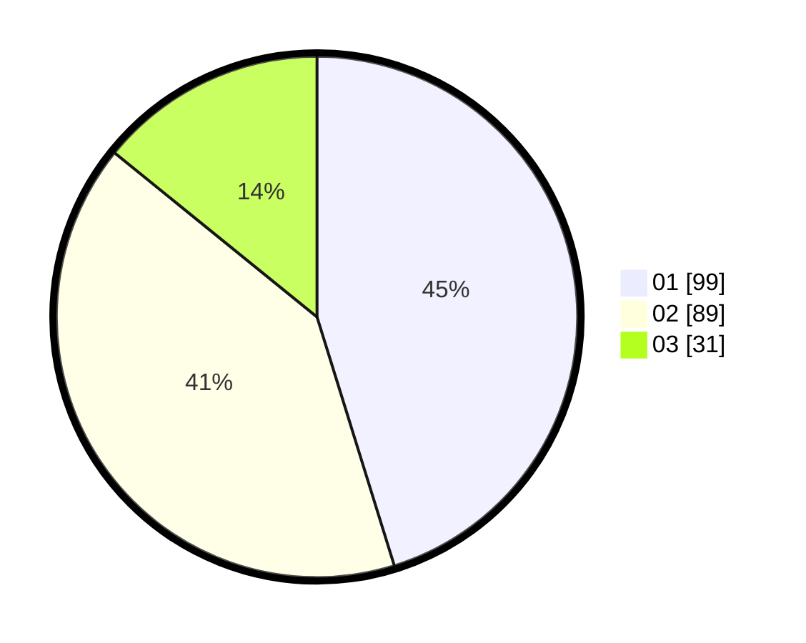

# Hasil

Hasil perolehan suara paslon dapat dilihat pada file paslon-01.txt, paslon-02.txt, dan paslon-03.txt.

Jika tidak ada, artinya data tersebut belum ada pada SIREKAP.

## Perolehan Suara

 * Paslon 01: **99**.
 * Paslon 02: **89**.
 * Paslon 03: **31**.

## Foto C Plano

https://sirekap-obj-formc.kpu.go.id/d1ff/pemilu/ppwp/31/73/06/10/05/3173061005137-20240214-155630--241af205-9f4e-4048-a341-9cdc68ac1d04.jpg

https://sirekap-obj-formc.kpu.go.id/d1ff/pemilu/ppwp/31/73/06/10/05/3173061005137-20240214-155423--5f58704a-e87f-4f7c-8877-f3aa099f202d.jpg

https://sirekap-obj-formc.kpu.go.id/d1ff/pemilu/ppwp/31/73/06/10/05/3173061005137-20240214-155505--7c255821-2e51-4a27-b823-abe124881ed3.jpg

## DATA PEMILIH TETAP

Jumlah pemilih dalam DPT: **293**.
 * L: **143**.
 * P: **150**.

## DATA PENGGUNA HAK PILIH

Jumlah pengguna hak pilih dalam DPT: **215**.
 * L: **109**.
 * P: **106**.

Jumlah pengguna hak pilih dalam DPTb: **3**.
 * L: **0**.
 * P: **3**.

Jumlah pengguna hak pilih dalam DPK: **5**.
 * L: **3**.
 * P: **2**.

Jumlah pengguna hak pilih: **223**.
 * L: **112**.
 * P: **111**.

## JUMLAH SUARA SAH DAN TIDAK SAH

JUMLAH SELURUH SUARA SAH: **219**.

JUMLAH SUARA TIDAK SAH: **4**.

JUMLAH SELURUH SUARA SAH DAN SUARA TIDAK SAH: **223**.
