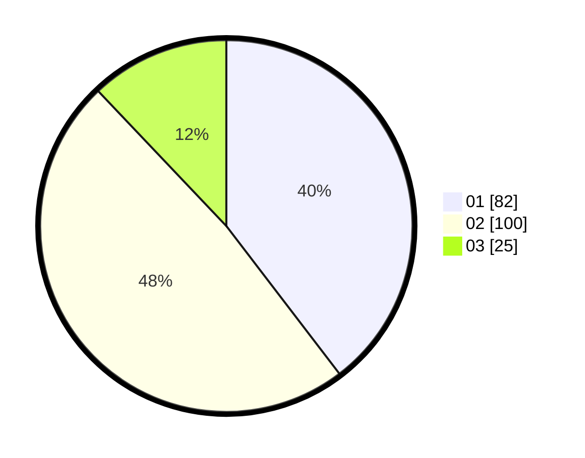

# Hasil

Hasil perolehan suara paslon dapat dilihat pada file paslon-01.txt, paslon-02.txt, dan paslon-03.txt.

Jika tidak ada, artinya data tersebut belum ada pada SIREKAP.

## Perolehan Suara

 * Paslon 01: **82**.
 * Paslon 02: **100**.
 * Paslon 03: **25**.

## Foto C Plano

https://sirekap-obj-formc.kpu.go.id/1950/pemilu/ppwp/31/73/06/10/05/3173061005143-20240214-155107--36a18db0-7e07-4f3f-8e6f-3536353238ac.jpg

https://sirekap-obj-formc.kpu.go.id/1950/pemilu/ppwp/31/73/06/10/05/3173061005143-20240214-155114--dd85ba89-0d50-4ead-bd49-de970c05a96b.jpg

https://sirekap-obj-formc.kpu.go.id/1950/pemilu/ppwp/31/73/06/10/05/3173061005143-20240214-155121--b8cd08f6-b9e1-4d23-9117-d588b8c3a3f4.jpg

## DATA PEMILIH TETAP

Jumlah pemilih dalam DPT: **267**.
 * L: **133**.
 * P: **134**.

## DATA PENGGUNA HAK PILIH

Jumlah pengguna hak pilih dalam DPT: **272**.
 * L: **107**.
 * P: **141**.

Jumlah pengguna hak pilih dalam DPTb: **0**.
 * L: **507**.
 * P: **50**.

Jumlah pengguna hak pilih dalam DPK: **72**.
 * L: **41**.
 * P: **1**.

Jumlah pengguna hak pilih: **213**.
 * L: **70**.
 * P: **0**.

## JUMLAH SUARA SAH DAN TIDAK SAH

JUMLAH SELURUH SUARA SAH: **7**.

JUMLAH SUARA TIDAK SAH: **2**.

JUMLAH SELURUH SUARA SAH DAN SUARA TIDAK SAH: **10**.
