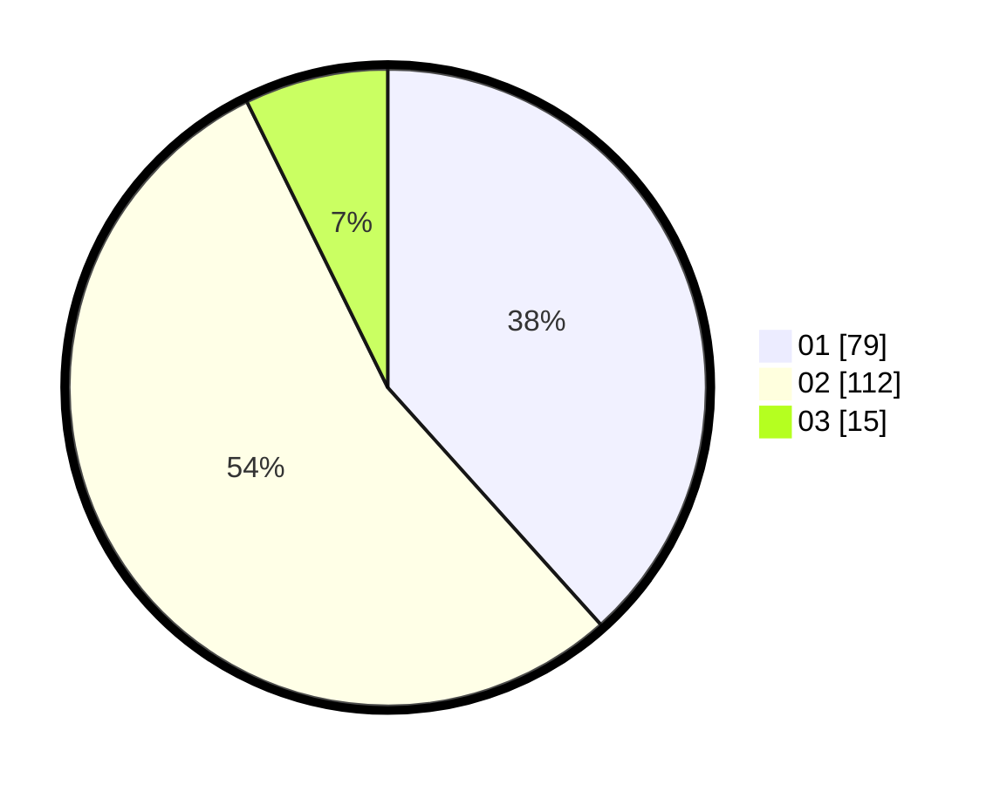

# Hasil

Hasil perolehan suara paslon dapat dilihat pada file paslon-01.txt, paslon-02.txt, dan paslon-03.txt.

Jika tidak ada, artinya data tersebut belum ada pada SIREKAP.

## Perolehan Suara

 * Paslon 01: **79**.
 * Paslon 02: **112**.
 * Paslon 03: **15**.

## Foto C Plano

https://sirekap-obj-formc.kpu.go.id/6454/pemilu/ppwp/31/73/06/10/05/3173061005144-20240214-223001--c8a3a01b-27a6-490a-997c-96bb77c549d7.jpg

https://sirekap-obj-formc.kpu.go.id/6454/pemilu/ppwp/31/73/06/10/05/3173061005144-20240214-223102--d48d5edb-0a40-4ca8-866a-aaf0d3a28b37.jpg

https://sirekap-obj-formc.kpu.go.id/6454/pemilu/ppwp/31/73/06/10/05/3173061005144-20240214-223156--9fb450a3-542b-4c32-9eea-91f6913250ea.jpg
