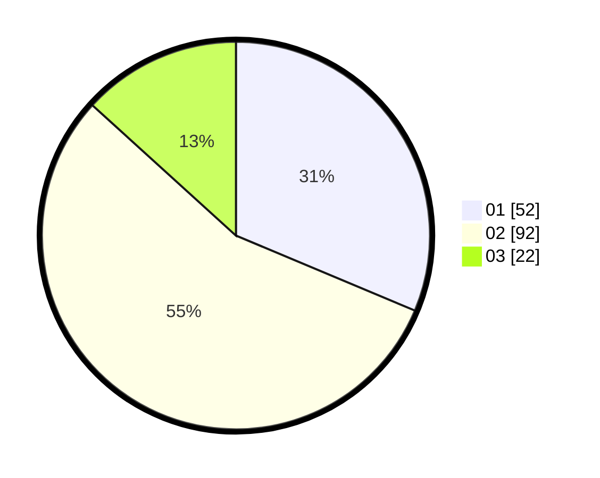

# Hasil

Hasil perolehan suara paslon dapat dilihat pada file paslon-01.txt, paslon-02.txt, dan paslon-03.txt.

Jika tidak ada, artinya data tersebut belum ada pada SIREKAP.

## Perolehan Suara

 * Paslon 01: **52**.
 * Paslon 02: **92**.
 * Paslon 03: **22**.

## Foto C Plano

https://sirekap-obj-formc.kpu.go.id/bf83/pemilu/ppwp/31/73/06/10/05/3173061005146-20240214-204922--2cb85b6d-aeb0-47b2-9882-6eedb0afba8e.jpg

https://sirekap-obj-formc.kpu.go.id/bf83/pemilu/ppwp/31/73/06/10/05/3173061005146-20240214-204958--99615adb-772b-4182-b553-011f8d9ef3f4.jpg

https://sirekap-obj-formc.kpu.go.id/bf83/pemilu/ppwp/31/73/06/10/05/3173061005146-20240214-205027--aac2ba35-fbed-4a4f-bf2a-e6548c772b0c.jpg
