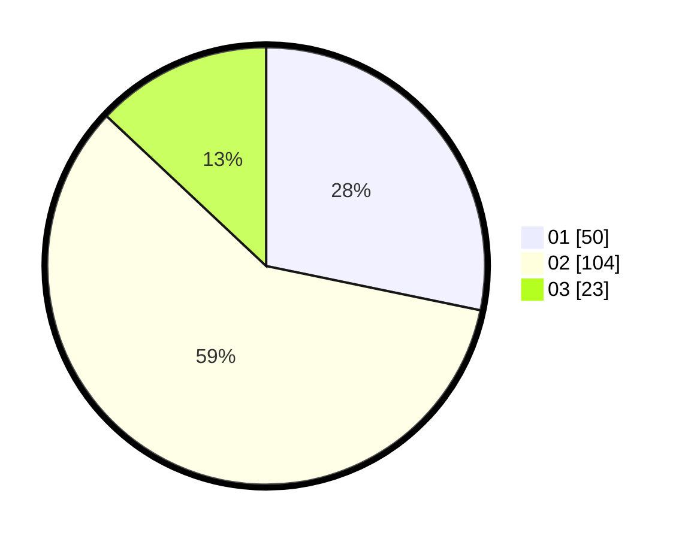

# Hasil

Hasil perolehan suara paslon dapat dilihat pada file paslon-01.txt, paslon-02.txt, dan paslon-03.txt.

Jika tidak ada, artinya data tersebut belum ada pada SIREKAP.

## Perolehan Suara

 * Paslon 01: **50**.
 * Paslon 02: **104**.
 * Paslon 03: **23**.

## Foto C Plano

https://sirekap-obj-formc.kpu.go.id/6f40/pemilu/ppwp/31/73/06/10/05/3173061005152-20240214-214318--e10ab0a5-9a98-4d8b-9e47-d84bf4a33728.jpg

https://sirekap-obj-formc.kpu.go.id/6f40/pemilu/ppwp/31/73/06/10/05/3173061005152-20240214-214331--d88cbf4d-3461-4db5-917e-285730feb681.jpg

https://sirekap-obj-formc.kpu.go.id/6f40/pemilu/ppwp/31/73/06/10/05/3173061005152-20240214-214344--f978da85-f2ca-4df5-afb5-1c98b79bd4a2.jpg
