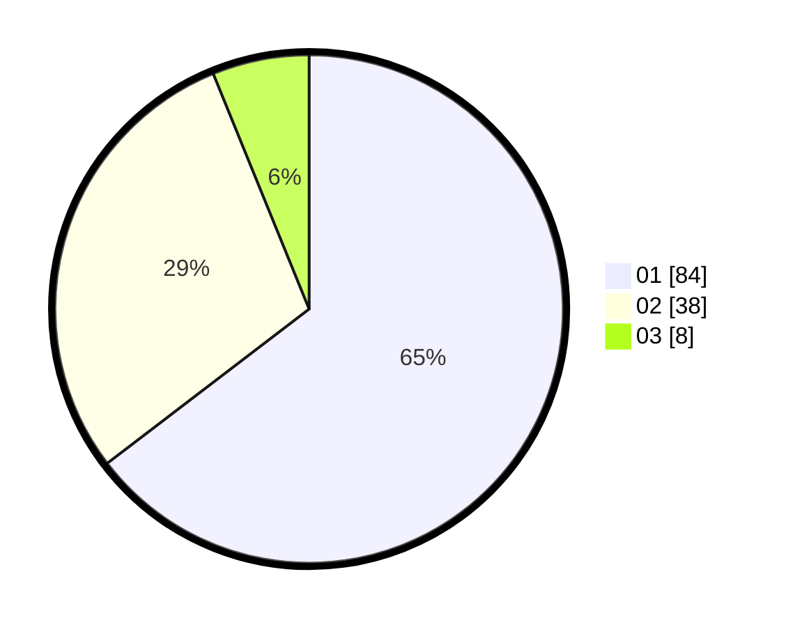

# Hasil

Hasil perolehan suara paslon dapat dilihat pada file paslon-01.txt, paslon-02.txt, dan paslon-03.txt.

Jika tidak ada, artinya data tersebut belum ada pada SIREKAP.

## Perolehan Suara

 * Paslon 01: **84**.
 * Paslon 02: **38**.
 * Paslon 03: **8**.

## Foto C Plano

https://sirekap-obj-formc.kpu.go.id/7453/pemilu/ppwp/31/73/06/10/05/3173061005159-20240214-185003--4dc17358-39fe-4813-ad70-174bc0843038.jpg

https://sirekap-obj-formc.kpu.go.id/7453/pemilu/ppwp/31/73/06/10/05/3173061005159-20240214-232015--b299c726-eb1f-4249-91bd-7116d69dc22d.jpg

https://sirekap-obj-formc.kpu.go.id/7453/pemilu/ppwp/31/73/06/10/05/3173061005159-20240214-185021--7e85a722-a4cc-43e2-8a08-50ec481b523b.jpg

## DATA PEMILIH TETAP

Jumlah pemilih dalam DPT: **167**.
 * L: **86**.
 * P: **81**.

## DATA PENGGUNA HAK PILIH

Jumlah pengguna hak pilih dalam DPT: **131**.
 * L: **68**.
 * P: **63**.

Jumlah pengguna hak pilih dalam DPTb: **0**.
 * L: **0**.
 * P: **0**.

Jumlah pengguna hak pilih dalam DPK: **1**.
 * L: **1**.
 * P: **0**.

Jumlah pengguna hak pilih: **132**.
 * L: **69**.
 * P: **63**.

## JUMLAH SUARA SAH DAN TIDAK SAH

JUMLAH SELURUH SUARA SAH: **130**.

JUMLAH SUARA TIDAK SAH: **2**.

JUMLAH SELURUH SUARA SAH DAN SUARA TIDAK SAH: **132**.
