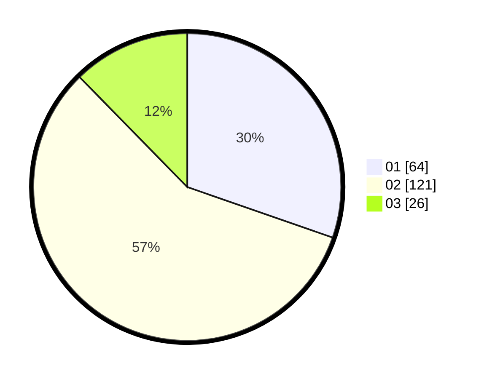

# Hasil

Hasil perolehan suara paslon dapat dilihat pada file paslon-01.txt, paslon-02.txt, dan paslon-03.txt.

Jika tidak ada, artinya data tersebut belum ada pada SIREKAP.

## Perolehan Suara

 * Paslon 01: **64**.
 * Paslon 02: **121**.
 * Paslon 03: **26**.

## Foto C Plano

https://sirekap-obj-formc.kpu.go.id/c895/pemilu/ppwp/31/73/06/10/05/3173061005164-20240214-234531--325e322e-7c76-461b-8a6a-19fee92bad67.jpg

https://sirekap-obj-formc.kpu.go.id/c895/pemilu/ppwp/31/73/06/10/05/3173061005164-20240214-234618--7dabb88d-f048-4df5-b67f-27076d3b0dee.jpg

https://sirekap-obj-formc.kpu.go.id/c895/pemilu/ppwp/31/73/06/10/05/3173061005164-20240214-234648--f7a54315-b422-45bb-a0dd-e26dd2cb6b2e.jpg
