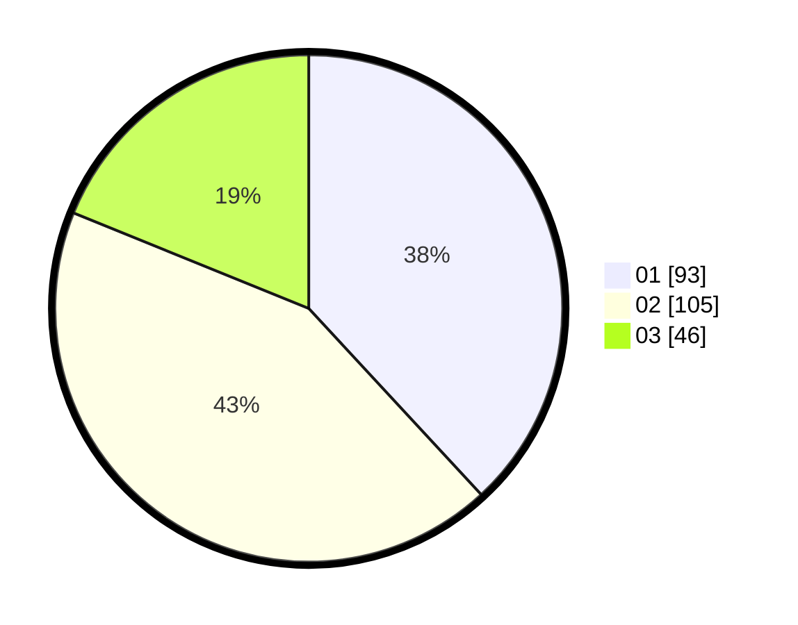

# Hasil

Hasil perolehan suara paslon dapat dilihat pada file paslon-01.txt, paslon-02.txt, dan paslon-03.txt.

Jika tidak ada, artinya data tersebut belum ada pada SIREKAP.

## Perolehan Suara

 * Paslon 01: **93**.
 * Paslon 02: **105**.
 * Paslon 03: **46**.

## Foto C Plano

https://sirekap-obj-formc.kpu.go.id/6758/pemilu/ppwp/31/73/06/10/05/3173061005175-20240214-214509--bd0193a8-5193-44b5-86b6-229fa0b4cb43.jpg

https://sirekap-obj-formc.kpu.go.id/6758/pemilu/ppwp/31/73/06/10/05/3173061005175-20240216-152258--f5c8c397-5b46-4a27-ab5a-391fee5459c3.jpg

https://sirekap-obj-formc.kpu.go.id/6758/pemilu/ppwp/31/73/06/10/05/3173061005175-20240214-214630--e23549d3-3f64-4e18-9883-d715f7e00258.jpg

## DATA PEMILIH TETAP

Jumlah pemilih dalam DPT: **298**.
 * L: **153**.
 * P: **145**.

## DATA PENGGUNA HAK PILIH

Jumlah pengguna hak pilih dalam DPT: **244**.
 * L: **121**.
 * P: **123**.

Jumlah pengguna hak pilih dalam DPTb: **0**.
 * L: **0**.
 * P: **0**.

Jumlah pengguna hak pilih dalam DPK: **4**.
 * L: **2**.
 * P: **2**.

Jumlah pengguna hak pilih: **248**.
 * L: **123**.
 * P: **125**.

## JUMLAH SUARA SAH DAN TIDAK SAH

JUMLAH SELURUH SUARA SAH: **244**.

JUMLAH SUARA TIDAK SAH: **4**.

JUMLAH SELURUH SUARA SAH DAN SUARA TIDAK SAH: **248**.
