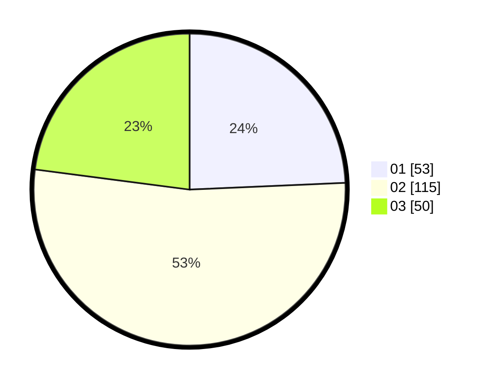

# Hasil

Hasil perolehan suara paslon dapat dilihat pada file paslon-01.txt, paslon-02.txt, dan paslon-03.txt.

Jika tidak ada, artinya data tersebut belum ada pada SIREKAP.

## Perolehan Suara

 * Paslon 01: **53**.
 * Paslon 02: **115**.
 * Paslon 03: **50**.

## Foto C Plano

https://sirekap-obj-formc.kpu.go.id/c234/pemilu/ppwp/31/73/06/10/05/3173061005176-20240214-214236--048a8358-88e3-4611-8001-045ff7da9c12.jpg

https://sirekap-obj-formc.kpu.go.id/c234/pemilu/ppwp/31/73/06/10/05/3173061005176-20240214-214648--0924de3d-262a-4d61-acf2-e40d1b9e27c9.jpg

https://sirekap-obj-formc.kpu.go.id/c234/pemilu/ppwp/31/73/06/10/05/3173061005176-20240214-215157--9718dc6b-c135-465e-9111-3deae103d7ff.jpg
