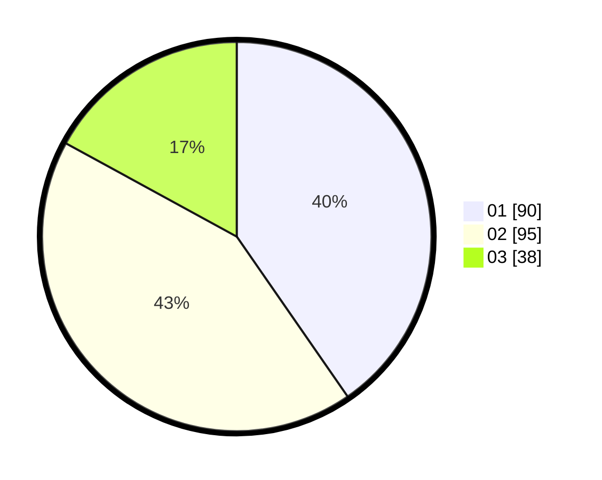

# Hasil

Hasil perolehan suara paslon dapat dilihat pada file paslon-01.txt, paslon-02.txt, dan paslon-03.txt.

Jika tidak ada, artinya data tersebut belum ada pada SIREKAP.

## Perolehan Suara

 * Paslon 01: **90**.
 * Paslon 02: **95**.
 * Paslon 03: **38**.

## Foto C Plano

https://sirekap-obj-formc.kpu.go.id/c27d/pemilu/ppwp/31/73/06/10/05/3173061005181-20240214-231713--8447746d-72aa-477c-a3fe-30f429df9187.jpg

https://sirekap-obj-formc.kpu.go.id/c27d/pemilu/ppwp/31/73/06/10/05/3173061005181-20240214-231856--b0405f4c-c5ab-4284-9402-d978c3805184.jpg

https://sirekap-obj-formc.kpu.go.id/c27d/pemilu/ppwp/31/73/06/10/05/3173061005181-20240214-232032--d4452b41-5950-4381-b264-d5eaac5cb23e.jpg
