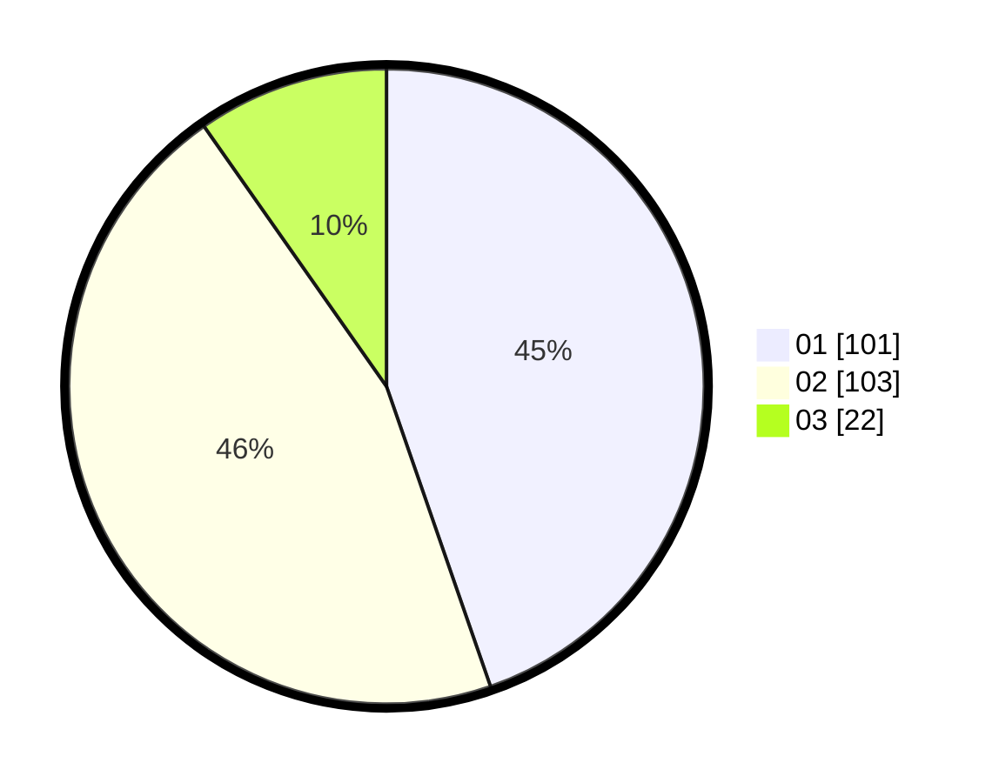

# Hasil

Hasil perolehan suara paslon dapat dilihat pada file paslon-01.txt, paslon-02.txt, dan paslon-03.txt.

Jika tidak ada, artinya data tersebut belum ada pada SIREKAP.

## Perolehan Suara

 * Paslon 01: **101**.
 * Paslon 02: **103**.
 * Paslon 03: **22**.

## Foto C Plano

https://sirekap-obj-formc.kpu.go.id/a2b9/pemilu/ppwp/31/73/06/10/05/3173061005185-20240214-220422--aac6a993-a663-4c21-bfb7-13da851cc56d.jpg

https://sirekap-obj-formc.kpu.go.id/a2b9/pemilu/ppwp/31/73/06/10/05/3173061005185-20240214-210507--82bc7f00-d80b-4c69-a49b-840d5c0bcbdd.jpg

https://sirekap-obj-formc.kpu.go.id/a2b9/pemilu/ppwp/31/73/06/10/05/3173061005185-20240214-220039--9e1a41fd-5fd5-416b-93d1-8443b6a69fe9.jpg
