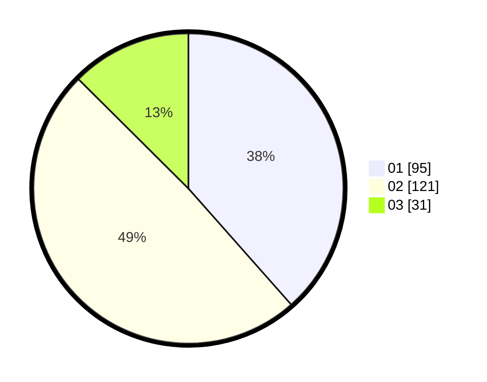

# Hasil

Hasil perolehan suara paslon dapat dilihat pada file paslon-01.txt, paslon-02.txt, dan paslon-03.txt.

Jika tidak ada, artinya data tersebut belum ada pada SIREKAP.

## Perolehan Suara

 * Paslon 01: **95**.
 * Paslon 02: **121**.
 * Paslon 03: **31**.

## Foto C Plano

https://sirekap-obj-formc.kpu.go.id/1155/pemilu/ppwp/31/73/06/10/05/3173061005189-20240214-223952--4bcc915c-d72f-44ae-ba9b-8b454f20fb12.jpg

https://sirekap-obj-formc.kpu.go.id/1155/pemilu/ppwp/31/73/06/10/05/3173061005189-20240214-224548--81d3aca5-a36b-497e-9f41-dcd21fae87c6.jpg

https://sirekap-obj-formc.kpu.go.id/1155/pemilu/ppwp/31/73/06/10/05/3173061005189-20240214-225000--3dd3a9e6-ecc5-48c9-bf13-a8ad8a918c63.jpg
