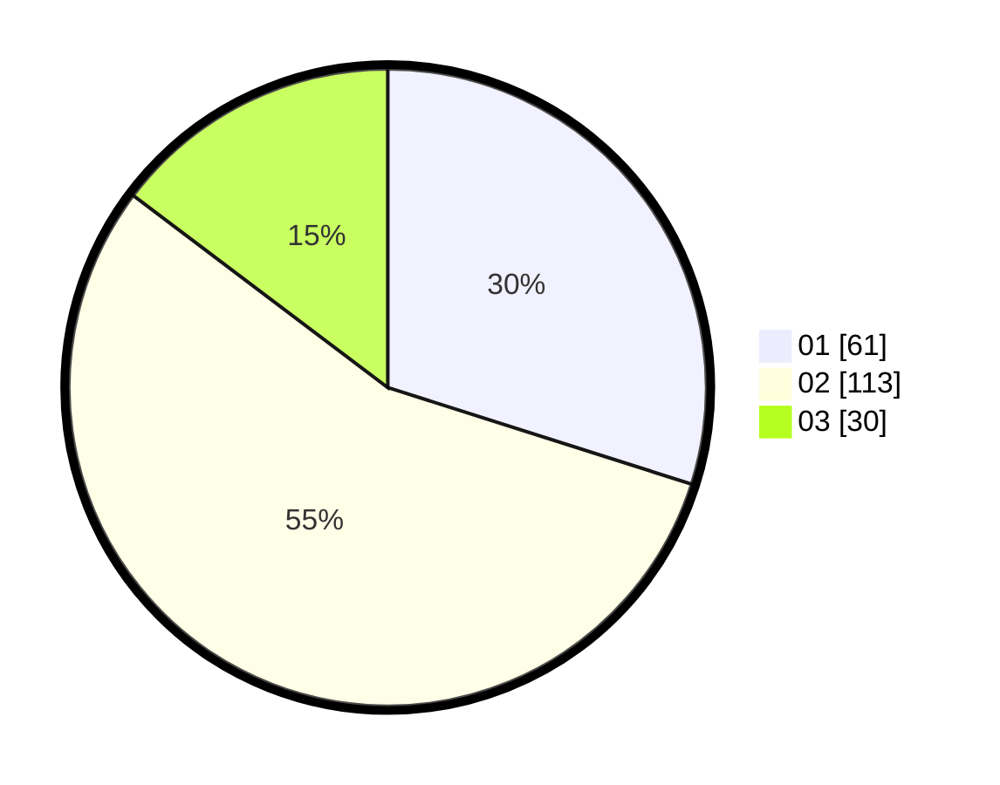

# Hasil

Hasil perolehan suara paslon dapat dilihat pada file paslon-01.txt, paslon-02.txt, dan paslon-03.txt.

Jika tidak ada, artinya data tersebut belum ada pada SIREKAP.

## Perolehan Suara

 * Paslon 01: **61**.
 * Paslon 02: **113**.
 * Paslon 03: **30**.

## Foto C Plano

https://sirekap-obj-formc.kpu.go.id/ed8d/pemilu/ppwp/31/73/06/10/05/3173061005193-20240214-192448--42eeb016-bf9e-474a-8c26-29dab77a837a.jpg

https://sirekap-obj-formc.kpu.go.id/ed8d/pemilu/ppwp/31/73/06/10/05/3173061005193-20240214-215844--ec509c93-3b41-46f3-94d5-bfc8d419c9e9.jpg

https://sirekap-obj-formc.kpu.go.id/ed8d/pemilu/ppwp/31/73/06/10/05/3173061005193-20240214-204602--8c4e8177-15a5-4731-a094-1a90c1e9473d.jpg

## DATA PEMILIH TETAP

Jumlah pemilih dalam DPT: **292**.
 * L: **147**.
 * P: **145**.

## DATA PENGGUNA HAK PILIH

Jumlah pengguna hak pilih dalam DPT: **207**.
 * L: **96**.
 * P: **111**.

Jumlah pengguna hak pilih dalam DPTb: **1**.
 * L: **0**.
 * P: **1**.

Jumlah pengguna hak pilih dalam DPK: **1**.
 * L: **1**.
 * P: **0**.

Jumlah pengguna hak pilih: **209**.
 * L: **97**.
 * P: **112**.

## JUMLAH SUARA SAH DAN TIDAK SAH

JUMLAH SELURUH SUARA SAH: **204**.

JUMLAH SUARA TIDAK SAH: **5**.

JUMLAH SELURUH SUARA SAH DAN SUARA TIDAK SAH: **209**.
