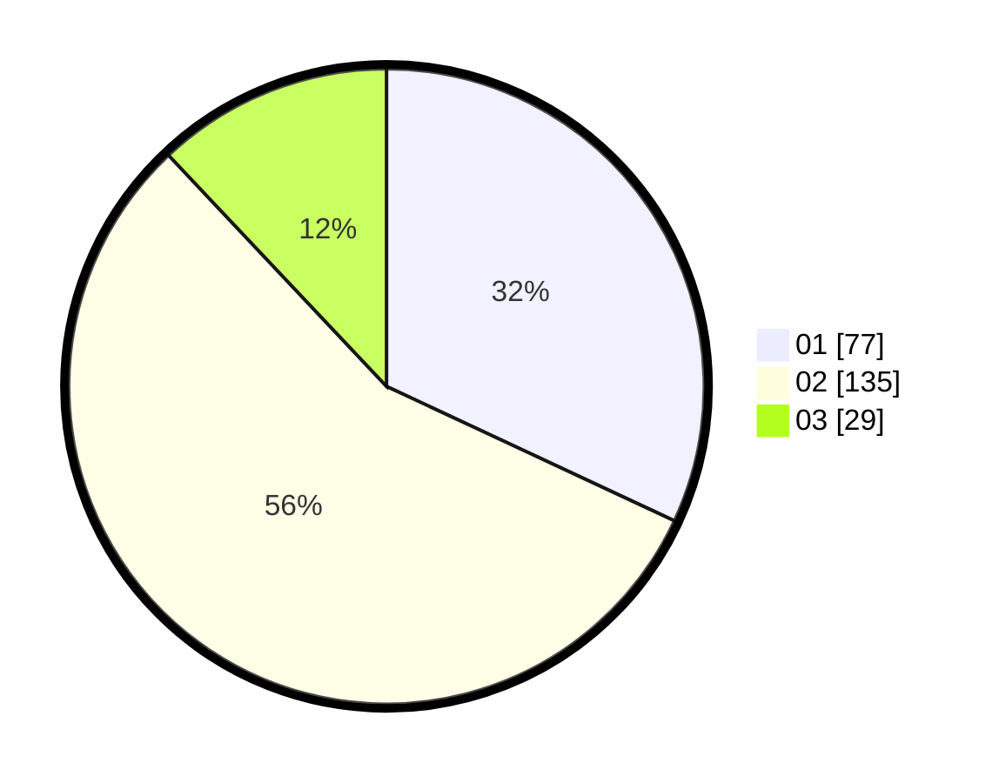

# Hasil

Hasil perolehan suara paslon dapat dilihat pada file paslon-01.txt, paslon-02.txt, dan paslon-03.txt.

Jika tidak ada, artinya data tersebut belum ada pada SIREKAP.

## Perolehan Suara

 * Paslon 01: **77**.
 * Paslon 02: **135**.
 * Paslon 03: **29**.

## Foto C Plano

https://sirekap-obj-formc.kpu.go.id/de35/pemilu/ppwp/31/73/06/10/05/3173061005194-20240214-205353--99997107-984b-4e46-9df7-0e1f87fe7df1.jpg

https://sirekap-obj-formc.kpu.go.id/de35/pemilu/ppwp/31/73/06/10/05/3173061005194-20240214-205357--83d80f10-f73f-496d-8a45-cea2b5e629a4.jpg

https://sirekap-obj-formc.kpu.go.id/de35/pemilu/ppwp/31/73/06/10/05/3173061005194-20240214-205403--15fa098b-3b7b-480b-8353-08a6cb3278d2.jpg

## DATA PEMILIH TETAP

Jumlah pemilih dalam DPT: **297**.
 * L: **139**.
 * P: **158**.

## DATA PENGGUNA HAK PILIH

Jumlah pengguna hak pilih dalam DPT: **244**.
 * L: **112**.
 * P: **132**.

Jumlah pengguna hak pilih dalam DPTb: **0**.
 * L: **0**.
 * P: **0**.

Jumlah pengguna hak pilih dalam DPK: **0**.
 * L: **0**.
 * P: **0**.

Jumlah pengguna hak pilih: **244**.
 * L: **112**.
 * P: **132**.

## JUMLAH SUARA SAH DAN TIDAK SAH

JUMLAH SELURUH SUARA SAH: **241**.

JUMLAH SUARA TIDAK SAH: **3**.

JUMLAH SELURUH SUARA SAH DAN SUARA TIDAK SAH: **244**.
