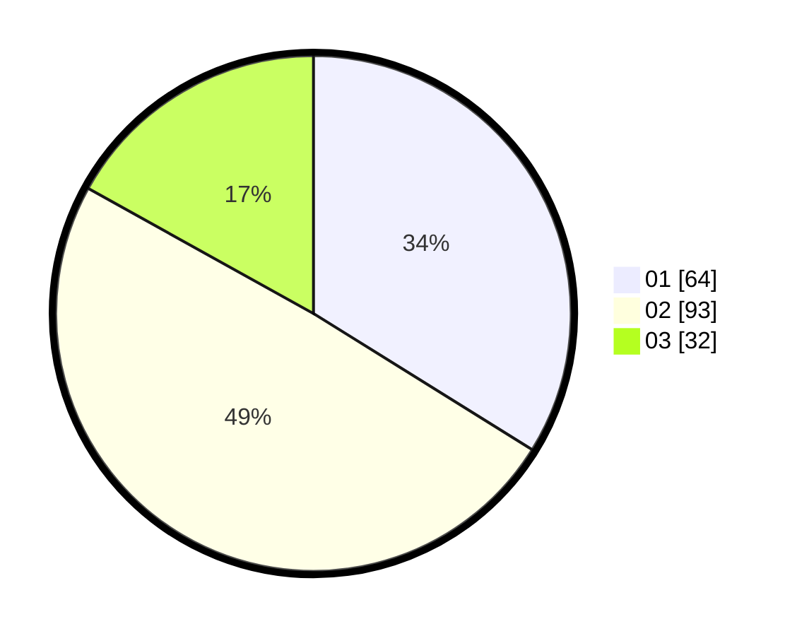

# Hasil

Hasil perolehan suara paslon dapat dilihat pada file paslon-01.txt, paslon-02.txt, dan paslon-03.txt.

Jika tidak ada, artinya data tersebut belum ada pada SIREKAP.

## Perolehan Suara

 * Paslon 01: **64**.
 * Paslon 02: **93**.
 * Paslon 03: **32**.

## Foto C Plano

https://sirekap-obj-formc.kpu.go.id/c2b4/pemilu/ppwp/31/73/06/10/05/3173061005195-20240214-234734--2abf1cdf-2550-4af3-ad32-03417f30a69b.jpg

https://sirekap-obj-formc.kpu.go.id/c2b4/pemilu/ppwp/31/73/06/10/05/3173061005195-20240214-234903--50fb47b8-b216-45b7-86f3-c73d89f1d8f6.jpg
