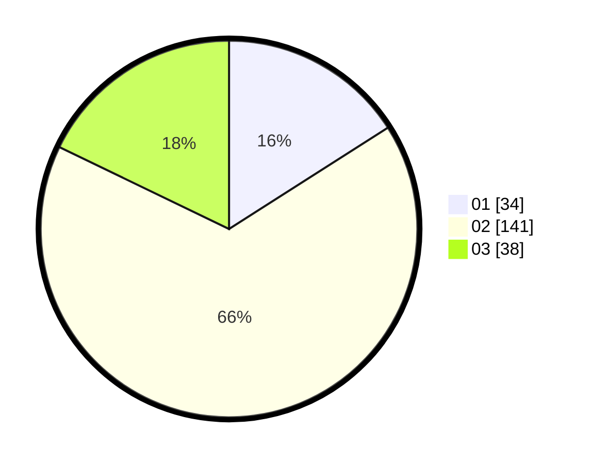

# Hasil

Hasil perolehan suara paslon dapat dilihat pada file paslon-01.txt, paslon-02.txt, dan paslon-03.txt.

Jika tidak ada, artinya data tersebut belum ada pada SIREKAP.

## Perolehan Suara

 * Paslon 01: **34**.
 * Paslon 02: **141**.
 * Paslon 03: **38**.

## Foto C Plano

https://sirekap-obj-formc.kpu.go.id/f8f1/pemilu/ppwp/31/73/06/10/05/3173061005197-20240214-232539--125e1542-6370-46de-a917-5121f26b64c1.jpg

https://sirekap-obj-formc.kpu.go.id/f8f1/pemilu/ppwp/31/73/06/10/05/3173061005197-20240214-232612--5d00959c-e2e6-4f82-ab59-c6554e7b2d13.jpg

https://sirekap-obj-formc.kpu.go.id/f8f1/pemilu/ppwp/31/73/06/10/05/3173061005197-20240214-232650--0cac46fb-d087-445f-854d-074a18ca3eb9.jpg
