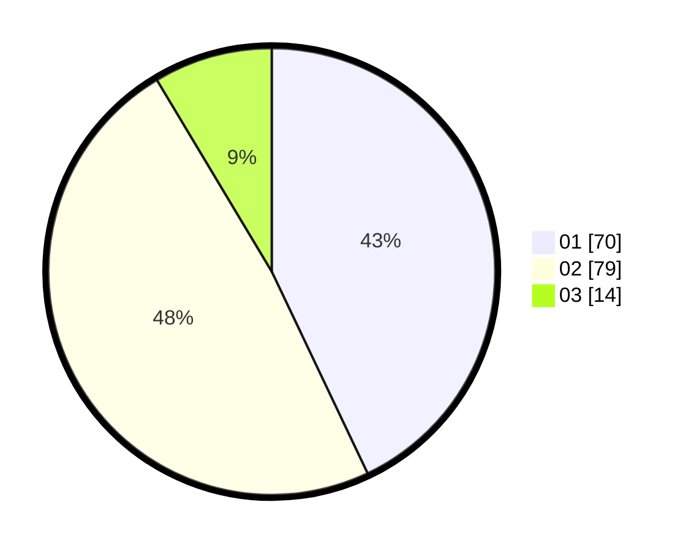

# Hasil

Hasil perolehan suara paslon dapat dilihat pada file paslon-01.txt, paslon-02.txt, dan paslon-03.txt.

Jika tidak ada, artinya data tersebut belum ada pada SIREKAP.

## Perolehan Suara

 * Paslon 01: **70**.
 * Paslon 02: **79**.
 * Paslon 03: **14**.

## Foto C Plano

https://sirekap-obj-formc.kpu.go.id/e56c/pemilu/ppwp/31/73/06/10/05/3173061005201-20240215-065332--bf2310ee-7937-488e-b4d2-0c7379b54d1a.jpg

https://sirekap-obj-formc.kpu.go.id/e56c/pemilu/ppwp/31/73/06/10/05/3173061005201-20240215-065353--9e79ee9d-da55-4919-bd49-c82e2de19472.jpg

https://sirekap-obj-formc.kpu.go.id/e56c/pemilu/ppwp/31/73/06/10/05/3173061005201-20240215-065409--e22f5ae0-4001-4221-9fbb-0d793832df09.jpg
