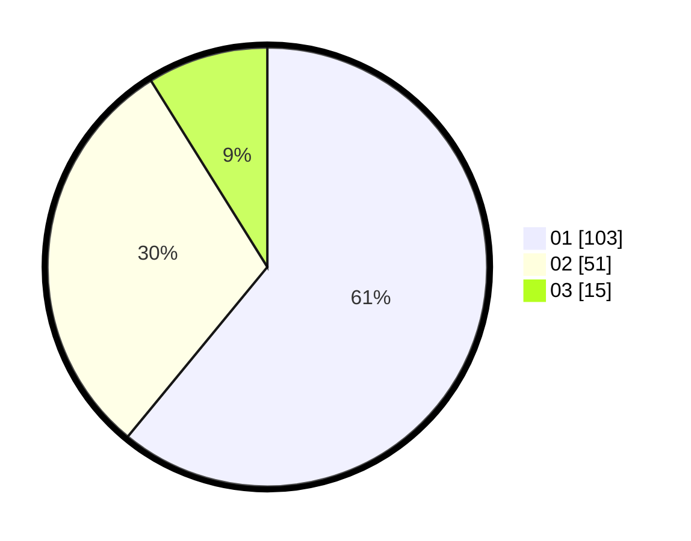

# Hasil

Hasil perolehan suara paslon dapat dilihat pada file paslon-01.txt, paslon-02.txt, dan paslon-03.txt.

Jika tidak ada, artinya data tersebut belum ada pada SIREKAP.

## Perolehan Suara

 * Paslon 01: **103**.
 * Paslon 02: **51**.
 * Paslon 03: **15**.

## Foto C Plano

https://sirekap-obj-formc.kpu.go.id/e2a6/pemilu/ppwp/31/73/06/10/05/3173061005202-20240214-214847--d8f1c958-30f9-4371-8239-76de4b45c6d2.jpg

https://sirekap-obj-formc.kpu.go.id/e2a6/pemilu/ppwp/31/73/06/10/05/3173061005202-20240214-214822--dc5567f4-ee95-4007-81ec-ab95cfde4b65.jpg

https://sirekap-obj-formc.kpu.go.id/e2a6/pemilu/ppwp/31/73/06/10/05/3173061005202-20240216-182815--dd1c93dd-7f4f-4937-9d07-82d9bcdf9243.jpg

## DATA PEMILIH TETAP

Jumlah pemilih dalam DPT: **207**.
 * L: **104**.
 * P: **103**.

## DATA PENGGUNA HAK PILIH

Jumlah pengguna hak pilih dalam DPT: **169**.
 * L: **80**.
 * P: **89**.

Jumlah pengguna hak pilih dalam DPTb: **0**.
 * L: **0**.
 * P: **0**.

Jumlah pengguna hak pilih dalam DPK: **2**.
 * L: **1**.
 * P: **1**.

Jumlah pengguna hak pilih: **171**.
 * L: **81**.
 * P: **90**.

## JUMLAH SUARA SAH DAN TIDAK SAH

JUMLAH SELURUH SUARA SAH: **169**.

JUMLAH SUARA TIDAK SAH: **2**.

JUMLAH SELURUH SUARA SAH DAN SUARA TIDAK SAH: **171**.
