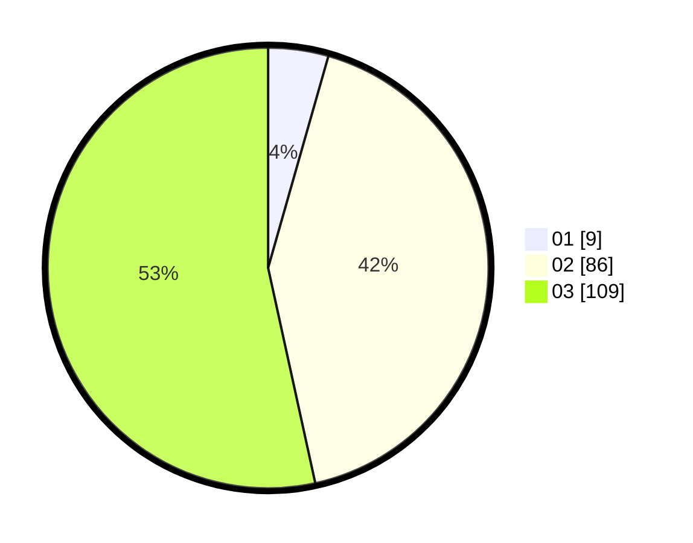

# Hasil

Hasil perolehan suara paslon dapat dilihat pada file paslon-01.txt, paslon-02.txt, dan paslon-03.txt.

Jika tidak ada, artinya data tersebut belum ada pada SIREKAP.

## Perolehan Suara

 * Paslon 01: **9**.
 * Paslon 02: **86**.
 * Paslon 03: **109**.

## Foto C Plano

https://sirekap-obj-formc.kpu.go.id/8dba/pemilu/ppwp/31/73/06/10/05/3173061005205-20240214-231745--234089ff-2ced-49c8-9aa6-562f7652633e.jpg

https://sirekap-obj-formc.kpu.go.id/8dba/pemilu/ppwp/31/73/06/10/05/3173061005205-20240214-231753--8f6f3f03-6b8c-481b-9a88-36b325e3ea1a.jpg

https://sirekap-obj-formc.kpu.go.id/8dba/pemilu/ppwp/31/73/06/10/05/3173061005205-20240214-231757--02d03f94-96ad-40ed-ba79-2746b5112f31.jpg
