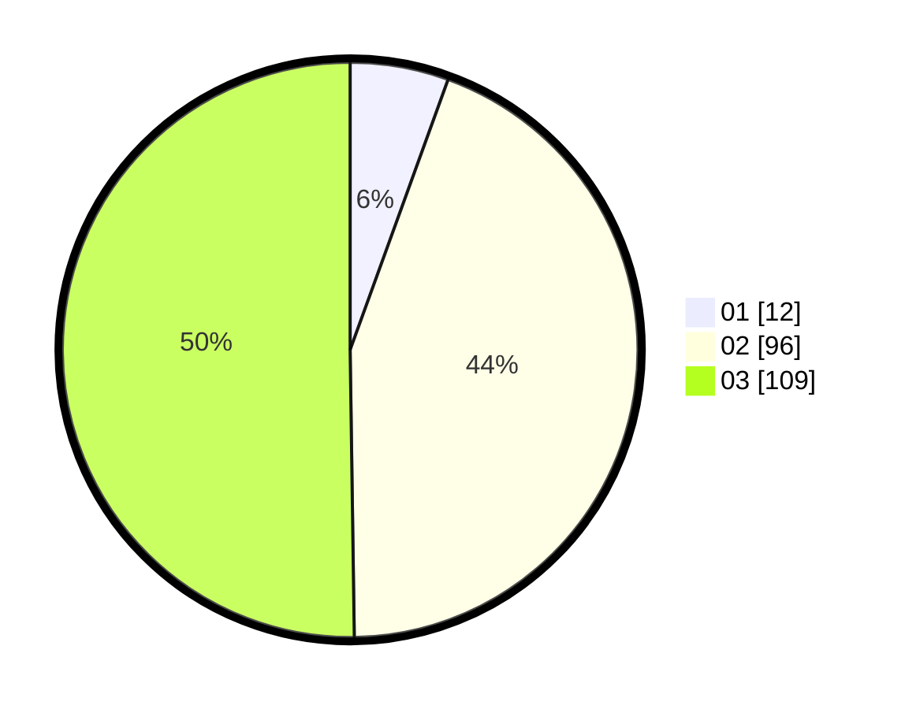

# Hasil

Hasil perolehan suara paslon dapat dilihat pada file paslon-01.txt, paslon-02.txt, dan paslon-03.txt.

Jika tidak ada, artinya data tersebut belum ada pada SIREKAP.

## Perolehan Suara

 * Paslon 01: **12**.
 * Paslon 02: **96**.
 * Paslon 03: **109**.

## Foto C Plano

https://sirekap-obj-formc.kpu.go.id/c69b/pemilu/ppwp/31/73/06/10/05/3173061005207-20240214-185523--ab65f016-931a-4cda-a131-60f282cd019d.jpg

https://sirekap-obj-formc.kpu.go.id/c69b/pemilu/ppwp/31/73/06/10/05/3173061005207-20240214-185528--30ee8ab2-b11e-49d1-9837-f5931955ea97.jpg

https://sirekap-obj-formc.kpu.go.id/c69b/pemilu/ppwp/31/73/06/10/05/3173061005207-20240214-185531--26f3aa66-528e-4333-a989-c830e3c8985b.jpg
