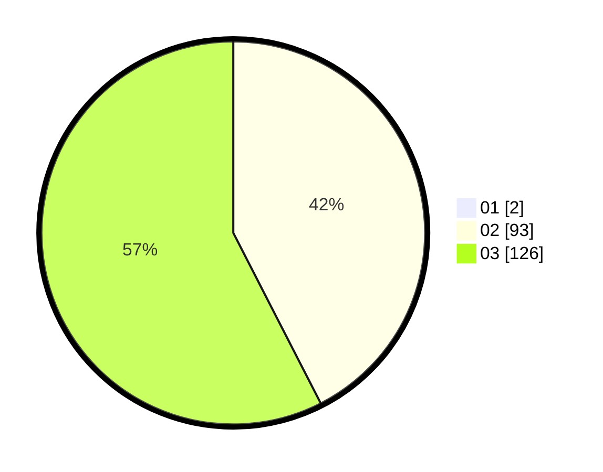

# Hasil

Hasil perolehan suara paslon dapat dilihat pada file paslon-01.txt, paslon-02.txt, dan paslon-03.txt.

Jika tidak ada, artinya data tersebut belum ada pada SIREKAP.

## Perolehan Suara

 * Paslon 01: **2**.
 * Paslon 02: **93**.
 * Paslon 03: **126**.

## Foto C Plano

https://sirekap-obj-formc.kpu.go.id/e691/pemilu/ppwp/31/73/06/10/05/3173061005212-20240214-201646--cfd94de2-e443-42f9-8ef9-1c26f7a11c4a.jpg

https://sirekap-obj-formc.kpu.go.id/e691/pemilu/ppwp/31/73/06/10/05/3173061005212-20240214-202943--58c4be62-2226-499c-841d-b0043bc1ae7e.jpg

https://sirekap-obj-formc.kpu.go.id/e691/pemilu/ppwp/31/73/06/10/05/3173061005212-20240214-203018--431bc334-c340-4dd4-8296-f43d730e6f16.jpg
