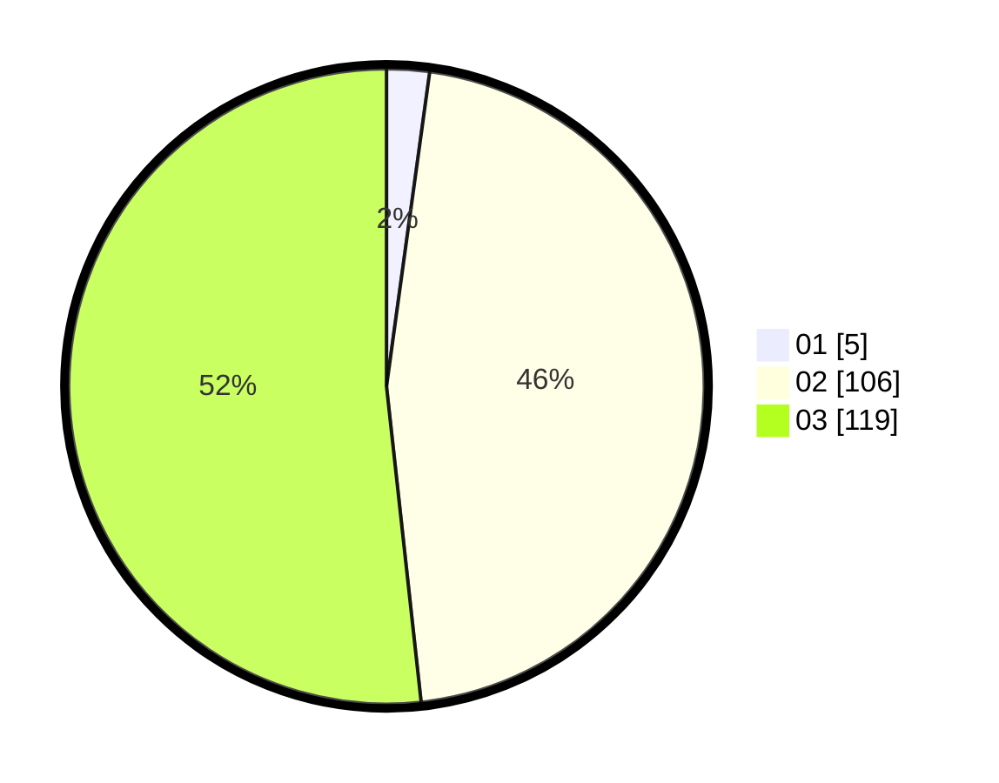

# Hasil

Hasil perolehan suara paslon dapat dilihat pada file paslon-01.txt, paslon-02.txt, dan paslon-03.txt.

Jika tidak ada, artinya data tersebut belum ada pada SIREKAP.

## Perolehan Suara

 * Paslon 01: **5**.
 * Paslon 02: **106**.
 * Paslon 03: **119**.

## Foto C Plano

https://sirekap-obj-formc.kpu.go.id/0ebb/pemilu/ppwp/31/73/06/10/05/3173061005219-20240214-192404--2f7195b0-95d8-4023-87d0-94ffeb1da417.jpg

https://sirekap-obj-formc.kpu.go.id/0ebb/pemilu/ppwp/31/73/06/10/05/3173061005219-20240214-192545--a098711d-0470-40d2-ad9a-717f3c5b9f1d.jpg

https://sirekap-obj-formc.kpu.go.id/0ebb/pemilu/ppwp/31/73/06/10/05/3173061005219-20240214-192629--1a5da7ca-151b-4b92-94c1-7ebb441a7b3c.jpg

## DATA PEMILIH TETAP

Jumlah pemilih dalam DPT: **292**.
 * L: **135**.
 * P: **157**.

## DATA PENGGUNA HAK PILIH

Jumlah pengguna hak pilih dalam DPT: **222**.
 * L: **108**.
 * P: **114**.

Jumlah pengguna hak pilih dalam DPTb: **2**.
 * L: **1**.
 * P: **1**.

Jumlah pengguna hak pilih dalam DPK: **7**.
 * L: **4**.
 * P: **3**.

Jumlah pengguna hak pilih: **231**.
 * L: **113**.
 * P: **118**.

## JUMLAH SUARA SAH DAN TIDAK SAH

JUMLAH SELURUH SUARA SAH: **230**.

JUMLAH SUARA TIDAK SAH: **1**.

JUMLAH SELURUH SUARA SAH DAN SUARA TIDAK SAH: **231**.
