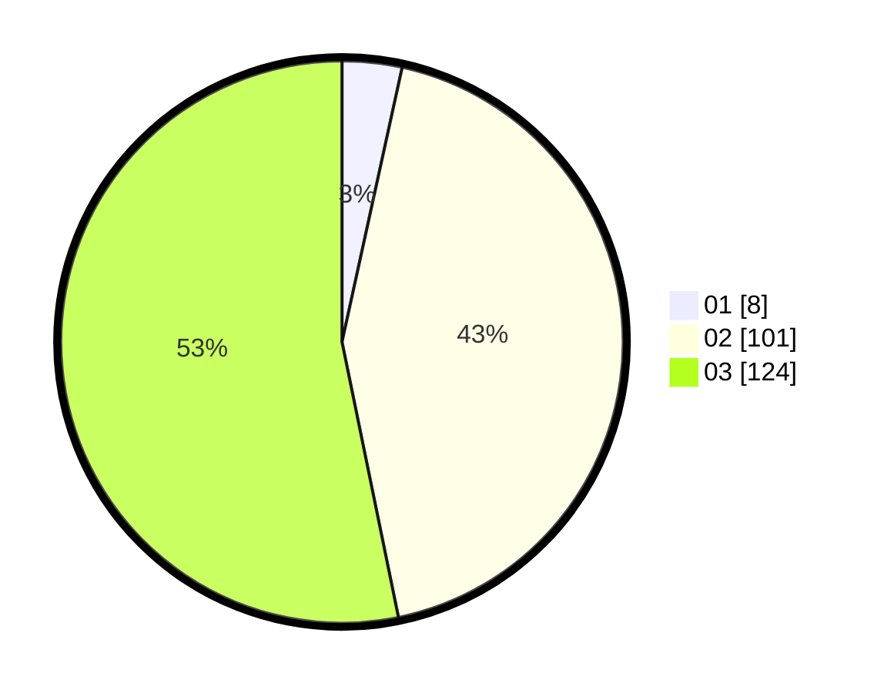

# Hasil

Hasil perolehan suara paslon dapat dilihat pada file paslon-01.txt, paslon-02.txt, dan paslon-03.txt.

Jika tidak ada, artinya data tersebut belum ada pada SIREKAP.

## Perolehan Suara

 * Paslon 01: **8**.
 * Paslon 02: **101**.
 * Paslon 03: **124**.

## Foto C Plano

https://sirekap-obj-formc.kpu.go.id/7927/pemilu/ppwp/31/73/06/10/05/3173061005220-20240214-200107--1c945e44-c128-4986-8d40-0758ed72f008.jpg

https://sirekap-obj-formc.kpu.go.id/7927/pemilu/ppwp/31/73/06/10/05/3173061005220-20240214-200427--5782f50f-08c1-45dd-8025-51a0562e715b.jpg

https://sirekap-obj-formc.kpu.go.id/7927/pemilu/ppwp/31/73/06/10/05/3173061005220-20240214-200656--d60de17a-9337-48c8-a459-1edae39fd231.jpg
