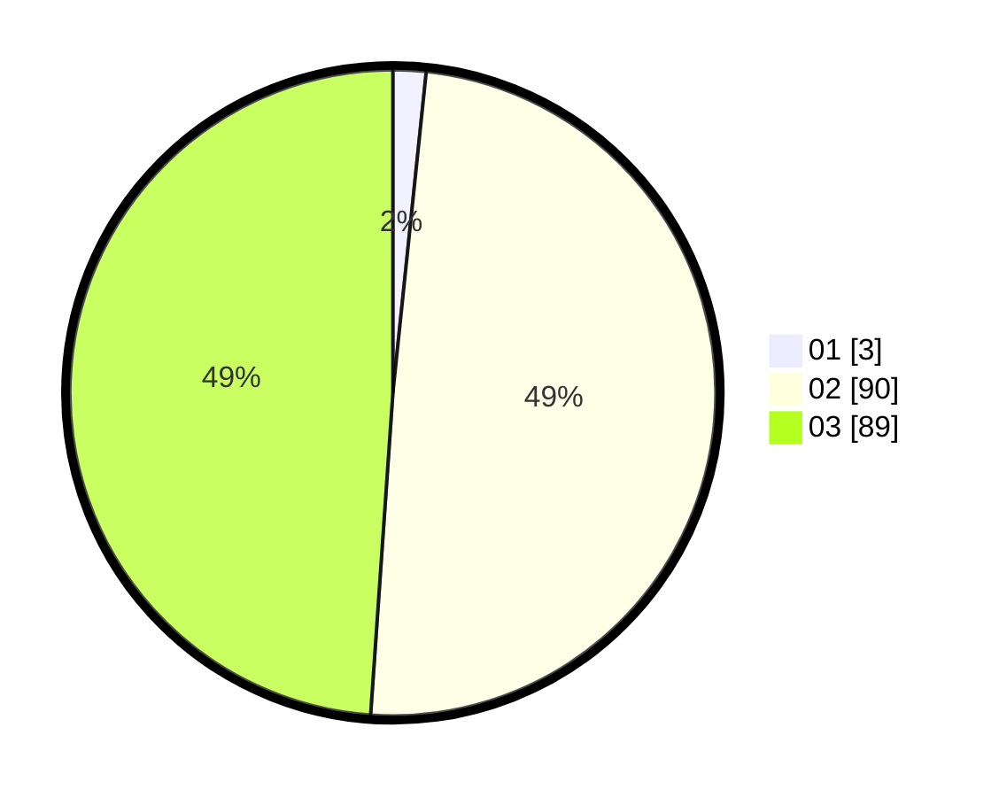

# Hasil

Hasil perolehan suara paslon dapat dilihat pada file paslon-01.txt, paslon-02.txt, dan paslon-03.txt.

Jika tidak ada, artinya data tersebut belum ada pada SIREKAP.

## Perolehan Suara

 * Paslon 01: **3**.
 * Paslon 02: **90**.
 * Paslon 03: **89**.

## Foto C Plano

https://sirekap-obj-formc.kpu.go.id/fdeb/pemilu/ppwp/31/73/06/10/05/3173061005225-20240214-201321--37df9580-3ebc-41ba-8835-0369a54347b5.jpg

https://sirekap-obj-formc.kpu.go.id/fdeb/pemilu/ppwp/31/73/06/10/05/3173061005225-20240214-201336--ae645039-fdb1-4af6-aa45-af342c8b8008.jpg

https://sirekap-obj-formc.kpu.go.id/fdeb/pemilu/ppwp/31/73/06/10/05/3173061005225-20240214-201345--bdd0e3bf-b5ac-4875-92c3-7812d9420e05.jpg

## DATA PEMILIH TETAP

Jumlah pemilih dalam DPT: **249**.
 * L: **115**.
 * P: **134**.

## DATA PENGGUNA HAK PILIH

Jumlah pengguna hak pilih dalam DPT: **180**.
 * L: **85**.
 * P: **95**.

Jumlah pengguna hak pilih dalam DPTb: **5**.
 * L: **3**.
 * P: **2**.

Jumlah pengguna hak pilih dalam DPK: **1**.
 * L: **1**.
 * P: **0**.

Jumlah pengguna hak pilih: **186**.
 * L: **89**.
 * P: **97**.

## JUMLAH SUARA SAH DAN TIDAK SAH

JUMLAH SELURUH SUARA SAH: **182**.

JUMLAH SUARA TIDAK SAH: **4**.

JUMLAH SELURUH SUARA SAH DAN SUARA TIDAK SAH: **186**.
